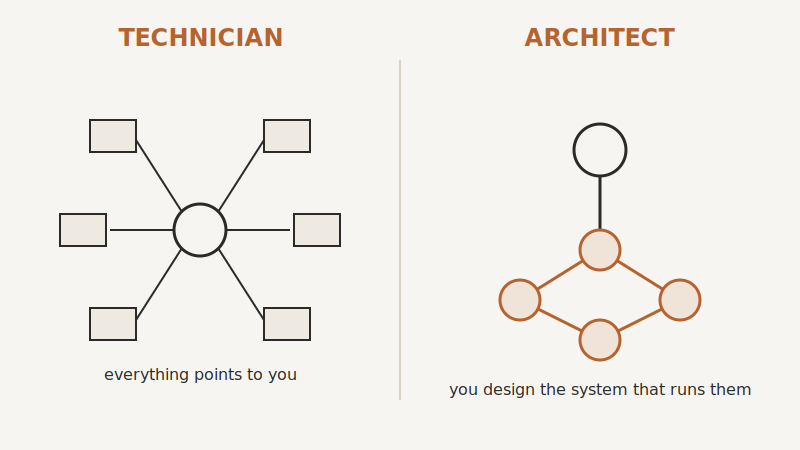

# The Automation Mindset: Thinking Like a Systems Genius

> "You do not rise to the level of your goals. You fall to the level of your systems."
>
> James Clear

## Why Most Businesses Stay Stuck in the Manual Grind: The Hidden Cost of Doing Everything Yourself

You didn't start your business to become a glorified task robot. Yet most small and medium service business owners find themselves buried in admin work, client emails, rescheduling appointments, chasing invoices, and putting out fires. Not because they lack hustle, but because they've built a business that depends on them being everywhere at once.

Every manual task you or your team repeats daily without a system is a hidden tax on your time and energy. That email you write from scratch every time a new enquiry comes in? That's a 2-minute task multiplied by 20 leads a week, times 52 weeks. That's 34 hours a year gone to something a simple automation could handle for you. And that's just one email. Now multiply this across client onboarding, follow-ups, reminders, reporting, and internal checklists. It adds up. The real cost isn't just time. It's opportunity. While you're stuck replying to a "Can we reschedule?" email for the third time today, someone else is using that same hour to build partnerships, launch a new service, or close a high-ticket deal.

Doing everything yourself feels noble. It feels efficient in the moment. You're "in control." But it's also the fastest way to hit a ceiling. No one builds a scalable business by being the hardest worker in the room. You build it by not needing to be in every room at all.

## Recognising The Automation Opportunity

Most service business owners are sitting on a goldmine of automatable tasks but can't see it because they're knee-deep in the mud. The irony is that the more time you're consumed by your business, the less perspective you have on how to improve it.

Start with this simple question: what do I do more than once a week that follows the same steps every time?

If the answer includes things like sending reminders, updating a spreadsheet, tagging a lead in your CRM, or copying information from one tool to another. You've struck automation oil. These are not just inefficiencies; they are opportunities for leverage.

You don't need to be a coder. You don't need to hire a team of developers. You just need to start looking at your daily operations as processes, not tasks. Once you start thinking in repeatable steps, you're halfway to automating them.

And this isn't about replacing people. It's about freeing them (and you) to focus on higher-value work. Things that require creativity, strategy, and human judgement. The kind of work that actually moves the needle.

## Why Working Harder Is Not the Answer

Let's be brutally honest: if working harder was the answer, you'd already be sipping cocktails in Mykonos while your business ran itself. But here you are, reading this, probably after a long day of firefighting, juggling client calls, and trying to remember if you sent that invoice.

Hard work got you here. But it won't get you there.

The truth is, there's a limit to how much you can hustle. There are only 24 hours in a day. And if you're spending most of them managing repetitive tasks, you're not running a business. You're running on a treadmill.

The trap is seductive. You get a dopamine hit every time you check something off your to-do list. You feel productive. But busy is not the same as effective. You can be flat-out all day and still be building a business that's fragile, dependent, and unscalable.

The businesses that grow without chaos are the ones that systemise their operations. They automate the boring stuff. They build infrastructure that scales. And they do it not because they're tech geniuses, but because they understand that the real power lies in building machines that work when they don't.

So if you're constantly asking yourself, "Why am I always so busy?" The answer may not be to try harder. It may be time to stop being the engine and start being the architect.

Switching from grind mode to system mode isn't just efficient. It's transformational. You don't need more hours. You need smarter systems.

## Rewiring Your Thinking for Leverage and Scale

"You're not just building a business. You're building a machine that builds your business for you."

If you're still the one chasing every invoice, answering every email, and manually updating spreadsheets while juggling sales calls, then yes, you're working hard. But you're not building leverage. You're not building scale. And you're almost certainly not building freedom. Let's change that.

This shift isn't about adding more hours or hiring more people. It's about upgrading your brain's operating system from technician to architect. From 'getting things done' to designing systems that get things done without you.

## From Technician to Architect Mindset

You didn't start a business to be your own most overworked employee. Yet so many business owners get stuck playing the technician: the doer, the fixer, the fire-fighter-in-chief. You're the one who knows how everything works, and that's exactly the problem. The technician builds a job. The architect builds a business.

You have to begin seeing your business not as a collection of tasks, but as a collection of systems. Each one is like a cog in a machine. You don't need to turn every cog. Your job is to design the machine so it runs without you.

Think of your business like a Formula 1 car. If you're the technician, you're under the hood, wrench in hand, oil on your face. If you're the architect, you're on the pit wall, watching the telemetry, making strategic decisions, and letting the systems and team execute. You're steering the ship, not rowing it.

This architect mindset means you stop saying, "How can I do this better?" and start asking, "How can this get done without me?"

Most service business owners are addicted to their own competence. You've spent years being the best at what you do. That's the trap. The better you are at doing the work, the harder it is to let go. But if you refuse to step out of the technician role, you'll always be capped by your own time, energy, and attention.

The goal here isn't to remove yourself from your business overnight. It's to gradually replace yourself in every operational role with a system that does the job better, faster or more reliably than you can.

{#fig-tech-architect width=80%}

## Embracing Delegation to Tech, Not People

When people hear "delegation," they immediately think of hiring. But throwing people at problems is the old way to scale. It's expensive, messy, and unpredictable. Hiring is not leverage. Code is. Systems are.

You don't need another pair of hands. You need a robot that never sleeps, never forgets, never calls in sick, and costs less than your monthly coffee bill.

You delegate to tech before you delegate to humans. That's the rule.

Let's say you're currently sending out proposals manually. That's not just time-consuming. It's error-prone. One zero in the wrong place, and you've either lost a sale or given away your margin. Instead of training an assistant to do it (and then constantly checking their work), build a system that autogenerates proposals from templated data. One click. Done. Every time you build a process that doesn't rely on a person, you've just removed a point of failure. You've also created a process that scales infinitely. Whether you get ten leads or ten thousand, the system doesn't care. It just works.

This doesn't mean you never hire. It means you hire smarter. You hire people to operate your systems, not to become the system.

Here's a rule of thumb: If a task happens more than once a week, ask yourself, "Can I automate this?" If not, ask, "Can I templatise it?" If not, then and only then ask, "Should I delegate this to a person?"

## Automation First, People Second

This shift in thinking unlocks exponential leverage. You go from being the bottleneck to being the orchestrator. You build once, use forever. You get to spend your time on strategy, innovation, and growth. Not inbox ping-pong and calendar Tetris.

## The Compounding ROI of Systems Thinking

There's a quiet, powerful force in business few people talk about: compounding systems. Just like compound interest grows your money without extra effort, well-built systems grow your time and profits without extra effort. Every hour you invest in building a system pays you back in hours saved, over and over again.

Let's say you spend four hours automating your client onboarding process. If you onboard five clients a month, and each one used to take you 45 minutes, you save nearly four hours a month going forward. In three months, you've already broken even. After that, it's pure time profit. That's ROI most investments can't touch.

And here's where it gets interesting. The more systems you stack, the more leverage you create. Automate lead capture. Automate client onboarding. Automate follow-ups. Now your marketing, sales, and delivery pipelines hum along without your daily involvement.

That's when your growth becomes unlinked from your calendar. Systems thinking also gives you clarity. When your business is built on ad hoc decisions and sticky notes, it's chaotic. You're reacting all the time. When your business is built on systems, it becomes predictable. You can see where the bottlenecks are. You can fix them once. You can scale with confidence.

This mindset also makes your business more valuable. No one wants to buy a business that only works when you're in the building. But a business with documented, automated systems? That's an asset. That's sellable, scalable, investable.

If your business runs on systems instead of you, you get options. You can scale. You can sell. You can step away. You can go on a three-week hiking trip in Patagonia and not come home to a disaster.

But it starts with seeing every problem in your business as a system waiting to be built. When something breaks or slows down, don't jump in. Zoom out. Ask, "What system would prevent this from happening again?" Then build that.

That's how you stop being the firefighter and start being the fire marshal.

Leverage isn't just a productivity hack. It's a business model. The service businesses that thrive in the next decade will be the ones that adopt this thinking early. They'll run leaner, faster, and smarter. They'll have better margins, happier clients, and saner founders. And they won't be doing it with more hustle. They'll be doing it with better systems.

So the next time you find yourself stuck in a loop of repetitive work, ask yourself: Is this a job for me, or a job for a system? Your future depends on how often the answer is the latter.

## Setting Your Business Up for Automation Success

Let's cut to the chase. If you're not setting your business up to be automated, you're setting it up to stay small, stressed, and stuck. Automation isn't about replacing humans. It's about reclaiming the time, energy, and mental bandwidth you're bleeding daily on things that should have been systemised months ago.

Now, you don't get automation gains by duct-taping tools together and hoping for the best. You need to build the right foundation. That starts with your business culture, your friction points, and your clarity of outcomes. Otherwise, you'll automate confusion, speed up inefficiency, and multiply mistakes. That's not leverage. That's chaos on autopilot.

Let's break it down.

### Building a Culture of Continuous Improvement

Automation is not a one-time project. It's not a "set it and forget it" play. It's a mindset baked into the DNA of your business. You want your business to be a living, breathing system that gets smarter every week. Not a rigid machine that collapses the moment something changes.

This requires a culture shift. Most service businesses run on tribal knowledge. Susan knows how to do customer onboarding, Dave knows how to chase late invoices, and you, well, you're holding 17 processes in your head like a human Wiki. That's a problem.

Start by normalising the idea that no process is sacred. Everything can be tweaked, tested, and tightened. Give your team permission to question how things are done. Reward improvements, not just output. If someone finds a way to get the same result in less time or with fewer steps, that's a win. Celebrate it.

You don't need to run a Six Sigma bootcamp. Just start with a simple principle: if it's repeated, it gets documented. If it's documented, it gets improved. And if it gets improved, it gets automated.

Here's a simple drill: at your next team meeting, ask everyone to bring one task they did last week that felt repetitive or annoying. Then ask, "What would need to be true for this to never touch your hands again?" That's the mindset shift. That's where automation begins, not with tech, but with thinking.

### Identifying Your High-Friction Processes

You don't need to automate everything. You need to automate the right things. Start with the sand in your gears. The moments that kill momentum, drain energy, and bottleneck growth.

High-friction processes are the ones that:

- Require multiple handoffs between people
- Involve repetitive manual data entry
- Depend on someone "remembering" to do them
- Cause delays when someone is off sick or on holiday
- Are done differently by different team members
- Break when volume increases

Think onboarding new clients, chasing unpaid invoices, scheduling appointments, updating spreadsheets, following up with leads. These are the silent killers of scale. They don't scream; they whisper you into burnout.

Don't rely on guesswork. Pull up your calendar, your team's task lists, and your inbox. Where are you spending time that doesn't require your expertise? Where are things slipping through the cracks? Where are you still playing middleman between two systems that don't talk?

One trick: look for "double entry." If your team is typing the same info into two different tools. Say, copying a lead from a web form into your CRM and then again into your invoicing system. You've got friction. And friction is where automation earns its keep.

Another indicator: delays. If a client has to wait more than a few hours to get a response, or if a proposal takes days instead of minutes to send, you're bleeding trust and time. Automation can compress those delays to near-zero, creating momentum your competitors can't match.

### Defining Clear Outcomes Before Automating

Automation without clarity is just faster confusion. Before you plug in tools, write a single zap, or start tinkering with workflows, you need to get brutally clear on your outcomes.

Ask yourself: What is the result I want this process to produce every time without needing human input?

That's the real goal. Not just "send invoice" or "email client," but "invoice gets sent automatically within 3 minutes of project completion, with accurate line items pulled from the job sheet, and a reminder scheduled if unpaid after 7 days."

See the difference? It's not about the step. It's about the result. Too many business owners automate tasks. Smart ones automate outcomes.

Start by mapping your process backwards. What does a successful result look like? Now ask: what inputs are needed to get that result? Where do those inputs currently live? Who owns them? Where do they break down? The more clarity you have here, the less likely you'll automate nonsense.

If you skip this step, you'll fall into the trap of automating for automation's sake. That's how businesses end up with Frankenstein systems, tools duct-taped together, with no one really sure what's happening behind the curtain. You don't want that. You want clean, predictable, scalable systems that deliver consistent outcomes.

Here's a quick gut-check: before you automate anything, try writing it as a one-sentence rule. Like, "When a new lead fills out the contact form, create a deal in the CRM, assign it to the sales rep on duty, and send a personalised email within 5 minutes." If you can't write it clearly, you're not ready to automate it.

Bonus tip: give your automations names that reflect their outcome. Not "Zap #42" or "Client Flow V3," but "Auto-Create Proposal After Discovery Call" or "New Client Welcome Sequence." This forces clarity. It also makes maintenance easier later.

Automation isn't a magic wand. It's a multiplier. Whatever systems you already have, good or bad, it will amplify them. If your processes are clunky, inconsistent, or unclear, automation will just help you make mistakes faster.

But if you build a culture that values continuous improvement, focus on high-friction processes, and define your outcomes with precision, automation stops being a buzzword and starts being a competitive weapon.

You don't need to be a tech genius. You need to think like a systems architect. Not: "How do I get this off my plate?" But: "How do I design this so it never needs a plate in the first place?" Start there. Everything else becomes easier.
