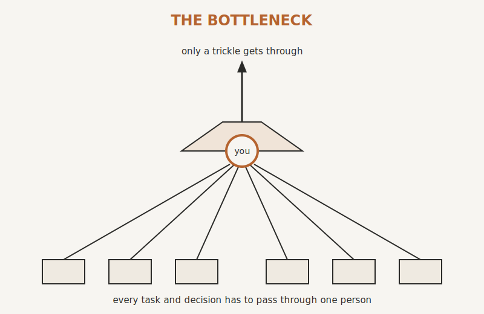

# You Are the Bottleneck

By the end of this chapter you will see, plainly and without flinching, the one thing that is capping your business. It is not the market. It is not your team. It is not the number of hours in the day. It is the way the business has been built, because it has been built around you.

Start with a morning you have probably lived.

The alarm goes, and before your feet hit the floor your hand is already on your phone. Thirteen emails overnight. One is a client who is "just checking in," which never means just checking in. One is a supplier problem that will cost money if it is not handled today. Three are questions from your own team, questions they could almost answer themselves, but not quite, not without you. By the time you are downstairs the day has already grabbed the wheel. You meant to spend the morning on the big proposal, the one that could change the year. Instead you spend it triaging, unblocking, reassuring and fixing. By nine o'clock you have done two hours of work, and none of it was *the* work.

You tell yourself it is a busy patch. It is not a busy patch. It is the design.

Here is what is actually happening. Every important road in your business runs through one junction, and the junction is you. Every decision of any weight, every exception, every unhappy client, every new hire's first hard question. It all arrives at the same desk, because nothing was ever built to send it anywhere else. You are not simply working hard. You are the single point through which the whole business has to pass. That is what a bottleneck is. And right now, it is you.

This is not a criticism of you. It is almost a compliment turned inside out. The reason everything comes to you is that, for years, you were the best person to bring it to. You knew the answer. You cared the most. You could be trusted to get it right. So people learned to bring you everything, and you learned to take it, and between you, without anyone ever deciding it on purpose, you built a business that cannot function without you standing in the middle of it.

## The Things You Don't Say Out Loud

In the daylight, you cope. You are the capable one, the owner who has it handled. But there are thoughts that arrive at two in the morning that you would never say in a meeting, and possibly have never said to anyone.

The first is the big one. If I stepped away, this would fall over. You know it. Half of how this business runs lives in your head and nowhere else. Not in a document, not in a system. In your head. That is not job security. It is a quiet kind of fear, and you carry it every day.  People assume your business is worth something.  But you know.  Deep down, you *know* that you're one bad bit of luck away from the business imploding.

There are others. You advise clients to delegate and to put proper systems in, while your own business is held together with spreadsheets, a good memory and goodwill. You would be embarrassed if a respected peer saw exactly how the engine runs under the bonnet, because the inside does not match the calm, capable picture the outside presents. You have tried to fix this before and it did not take, and some part of you has started to wonder whether it ever will. And underneath all of it, sometimes, a stranger thought. If the business did not need me every minute, who would I even be? Being indispensable has become part of who you are. Letting go of it feels less like relief and more like loss.

If any of that landed, notice something. None of it is a personal failing. Every one of those thoughts is the predictable result of the same root cause: a business built around a person instead of around systems. Naming it is not weakness. It is the first honest move toward fixing it.

## The Cost of Standing Still

It is tempting to think you can carry this indefinitely. You are coping, after all. But a bottleneck does not just make today hard. It quietly sets a ceiling on everything, and the ceiling gets lower the longer you stand under it.

Growth is the first casualty. Your business can only handle as much as you can personally touch, so the only way to grow is to add more people for you to manage, which adds more questions, more exceptions, more things flowing back to your desk. You hit a wall that no amount of effort can push through, because the wall is you.

Then there is the human cost, which rarely makes it onto a spreadsheet. The slow burn toward burnout, because the pace has no off switch. The good people who eventually leave, not for more money, but because they got tired of a place where nothing ever quite gets fixed. The dropped ball, the missed email, the late delivery that, on the wrong day with the wrong client, undoes a relationship you spent years building. The brilliant referral that arrives in the worst possible week, when you are too far underwater to chase it, so it goes to someone else. The holiday that is not really a holiday, because the phone stays on and the just-in-case calls keep coming. And further out, the business you cannot sell for what it should be worth, because a buyer looks under the bonnet and sees that the most valuable asset in the company is a person who wants to leave.

Meanwhile, quietly, the competitor down the road who systemised two years ago is pulling away. Better margins. Steadier delivery. Room to think. The gap does not open in one dramatic moment. It opens slowly, contract by contract, while you are busy firefighting.

None of this is meant to frighten you. It is meant to be honest about the price of the status quo, because that price is real, and you are already paying it.

## Why Working Harder Won't Save You

Faced with all this, the instinct of every capable owner is the same. Work harder. Get in earlier. Tighten the grip. You are very good at working hard. It is how you got here.

But hard work is not the lever any more, and deep down you may already know it. There are only so many hours, and you are already spending most of them. More effort poured into the same structure does not relieve the bottleneck. It feeds it. Every time you step in and personally rescue the situation, you teach the business one more time that it can rely on you to step in. The harder you work, the more dependent on you it becomes.

There is a comforting lie in busyness, too. Crossing things off a list feels like progress. It produces a little hit of satisfaction. (It actually releases But busy and effective are not the same thing, and you can be flat out from dawn to dusk while building something fragile, dependent and impossible to scale. Motion is not the same as movement.

So the way out is not a better to-do list or an earlier alarm. It is not doing more of what already is not working. The way out is to change the design, so that the business stops needing you in the middle of it. That is not a productivity tip. It is a different way of seeing your own job, and it is where we go next.

> **Try this.** For one ordinary working day, keep a simple note. Every time something stops and waits for you, a decision, an approval, an answer, a fix, write it down. Do not change anything, just notice. By the end of the day you will be holding a list, and that list is your bottleneck made visible. Soon we will know exactly what to dismantle.

{#fig-bottleneck width=80%}
