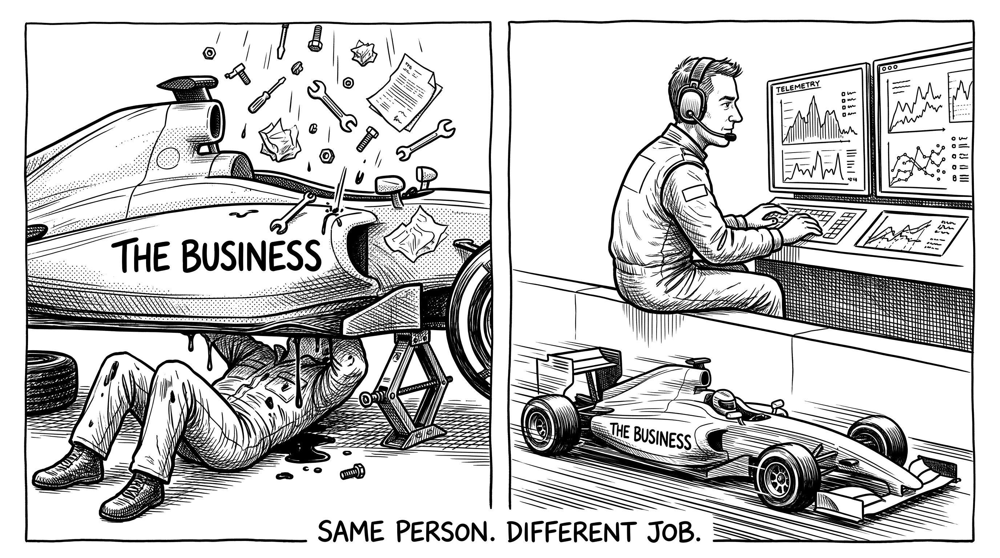
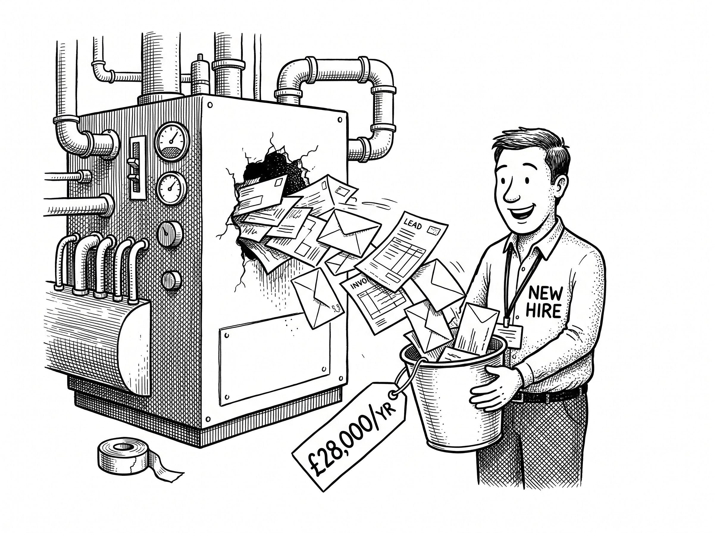

# From Technician to Architect

> *"We shape our buildings; thereafter they shape us."*
>
> Winston Churchill

By the end of this chapter you will understand the single shift that separates owners who escape the bottleneck from owners who stay stuck in it for the rest of their working lives. It is not a tool or a tactic. It is a change in how you see your own role.

Let me name the trap you are most likely caught in, because it is the one nobody warns you about. You are addicted to your own competence.

It is an easy addiction to develop. You spent years becoming genuinely excellent at the thing your business does. That excellence built your reputation and won your clients. So when a job needs doing well, the fastest, safest option always seems to be the same: do it yourself, or at least check it yourself. And every time you do, you get a small confirmation that you are the one who makes the difference. It feels good. It also quietly welds you to the bottleneck.

Because the better you are at the work, the harder it is to let go of it. The very skill that built the business is now the thing stopping it from growing past you.

## Two Jobs, and You Are Doing the Wrong One

Think about a Formula 1 team. There is the mechanic, head under the bonnet, hands covered in oil, fixing the car in front of him right now. And there is the person on the pit wall, watching the data across the whole race, deciding strategy, choosing when to pit, shaping the result without ever picking up a spanner.

::: {.content-visible when-format="typst"}
{fig-alt="Two panels: a mechanic buried under a car labelled THE BUSINESS; the same person calm on the pit wall with telemetry screens. Same person, different job." width=100%}
:::
::: {.content-visible unless-format="typst"}
{fig-alt="Two panels: a mechanic buried under a car labelled THE BUSINESS; the same person calm on the pit wall with telemetry screens. Same person, different job." width=100%}
:::

Most owners run their business with their head permanently under the bonnet. You are the mechanic, the technician, the fixer-in-chief. And while you are down there, nobody is on the pit wall.

These are two completely different jobs. The technician does the work. The architect designs the system that does the work. The technician builds himself a demanding job with no exit. The architect builds a business that has value whether he is in the room or not. You started as the technician because, in the early days, you had to be. The trap is that you never stopped.

The shift sounds simple, and it changes everything. You stop asking, "How do I do this better?" and you start asking, "How does this get done well without me?" The first question keeps you in the engine. The second one gets you onto the pit wall.

## Delegate to the Machine Before You Delegate to a Person

When most owners finally accept they cannot do it all, their first instinct is to hire. Get another pair of hands. And sometimes that is right. But hiring, on its own, is rarely the leverage people hope it is. People are expensive, they need managing, they have off days, and eventually some of them leave. Throw a person at a broken process and you now have a broken process with a salary attached, and one more person asking you questions. Cost have gone up. Average productivity per person? You've just lowered it.

::: {.content-visible when-format="typst"}
{fig-alt="A machine leaks paperwork from a hole while a cheerful new hire catches it in a bucket costing 28,000 pounds a year; nobody fixes the hole." width=88%}
:::
::: {.content-visible unless-format="typst"}
{fig-alt="A machine leaks paperwork from a hole while a cheerful new hire catches it in a bucket costing 28,000 pounds a year; nobody fixes the hole." width=88%}
:::

So here is a rule worth holding onto. Before you delegate a repeating task to a person, ask whether it should be delegated to a machine. A well-built system does not sleep, does not forget, does not call in sick, and does not need a one-to-one. It does the same thing, correctly, the thousandth time and the first. For the repetitive, rule-based, soul-sapping work that currently clogs your week, that is exactly what you want.

`#box(place(dx: 12pt, dy: 103pt, rotate(-8deg, origin: left + horizon, image("images/marginalia/mark-ch02-arrow-order.png", width: 86pt))))`{=typst}This is not anti-people. It is the opposite. When you hand the mechanical work to systems, the people you do employ get to do the work that actually needs a human: judgement, relationships, creativity, care. You stop hiring people to be the system, and you start hiring them to run it. The order matters. Automation first, people second. Decide what the machine should own, and only then decide what is left for a person.

## Why This Compounds

Here is the part that makes the effort worth it. A system you build once keeps paying out, and the payouts stack.

Spend an afternoon designing the way new clients are onboarded, properly, so it happens the same way every time without you, and you do not save that time once. You save it on every client who comes after, for as long as the business runs. Do the same for the next process, and the next, and the savings do not just add up, they compound, the way interest does. Every hour you design out of your week is an hour returned to you tomorrow, and the day after, and the year after. Every mistake you engineer away is a mistake that simply stops happening.

This is _leveraged_ work.  It's the most valuable work you can do.  It keeps paying you back for your effort.

And there is a prize at the end that most owners never reach. A business built on systems rather than on you is worth something. It can grow past your personal capacity, because growth no longer means more of your hours. It can survive you being ill, or away, or simply uninterested for a fortnight. And one day, if you choose, it can be sold, because what you are selling is a machine that works, not a job that happens to have your name on it.

That is the architect's return. Not just a lighter week, though you will get one. A business that finally has value independent of you.

## The Mindset Is Not Enough

So that is the shift. Stop being the best technician in the building and become the architect of a business that runs without you. If you take only one idea from this book, take that one.

But a mindset on its own will not move a single task off your plate. Knowing you should design systems is not the same as knowing which work to hand over, and what to hand it to. Some things genuinely need you. Some things should be automated and never touched by a human again. And some things are now best given to AI, which is a different tool with different strengths, and one that is widely misunderstood. Getting that decision right, task by task, is the real craft. It is the heart of this book, and it is exactly where we go next.

> **Try this.** Choose one task that currently only you do, and that comes around every week. Write a single sentence describing the result it should produce every time, with no input from you. For example: "Every new enquiry gets a personal reply within the hour, with the right information, logged in one place." You have just done the architect's job for the first time. You have described an outcome instead of doing a task. We are going to do a great deal more of that. (If you're enjoying this, write down a few more, while you're in the mood.)
