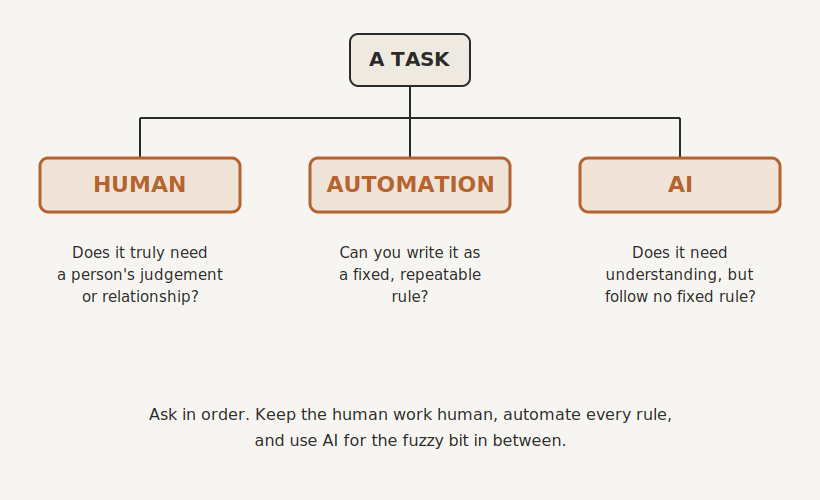

# The Triage: Human, Automation, or AI

By the end of this chapter you will have a single decision you can run on any task in your business, one that tells you whether it belongs to a human, to automation, or to AI. It is the most useful tool in this book, and once it is in your head you will start applying it to everything, often without noticing.

In a hospital emergency department, the first person you meet is not a surgeon. It is a triage nurse. Their entire job is to look at everyone who comes through the door and sort them, quickly, by the kind of care they need. Not to treat. To sort. Because if you treat people in the order they arrive, some of them die in the waiting room. The sorting is the thing that makes the whole department work.

Your business needs exactly the same discipline, and right now you are the only triage nurse it has, and you are sorting badly, because nobody ever gave you a method. Tasks arrive, and you deal with them in the order they shout loudest. The triage I am about to hand you fixes that. It is the heart of this book, and everything that follows is built on top of it.

Here it is. Every task in your business has a natural owner. Not you, necessarily. One of three.

## The Three Owners

**A human.** Some work genuinely needs a person. A difficult conversation with an unhappy client. A judgement call where the stakes are real and the situation is new. The creative leap. The relationship that took years to earn. The decision that, if it goes wrong, you have to answer for. These are not inefficiencies to be stamped out. Very often they are the actual point of your business. The goal of the triage is not to remove humans. It is to make sure your humans, and above all you, spend their time only on the work that truly needs them.

**An automation.** A great deal of what fills your week is not judgement at all. It is rules. When a new enquiry comes in, log it here and reply with that. When an invoice is thirty days overdue, send this reminder. When a client books, add them to the calendar, send the confirmation, and start the welcome sequence. Same trigger, same steps, same result, every single time. Work like this does not want a human and does not need anything as clever as AI. It wants a simple, reliable machine that does the exact same thing at three in the morning as it does at noon, without being asked twice. This is automation, and it is the quiet workhorse of an automatic business.

**An AI.** Then there is a middle band that, until very recently, had nowhere to go. Work that needs a little judgement, or an understanding of language, or the ability to make sense of something messy, but that does not rise to the level of needing a person. Read this rambling email and pull out what the client actually wants. Draft a first version of this proposal from these rough notes. Turn that hour-long call into five clear bullet points. Sort these two hundred enquiries into hot, warm and cold. This used to be human work, not because it was precious, but because nothing else could do it. Now AI can. That is genuinely new, and it is why this is a good moment to be reading this book.

## The Three Questions

So how do you actually sort a task? You ask three questions, in order.

First: does this truly need a human? Be honest, and be strict. Not "do I usually do it," but "would the business lose something real if a person did not?" If the answer is yes, it stays with a human. And then a sharper second question: does it need you, or just a human? Most things that need a person do not need you specifically. Those go to your team. You keep only what only you can do.

If it does not need a human, ask the second question: can I write it down as a clear rule? If this happens, do that. If you can describe the work as a fixed set of steps that runs the same way every time, it is automation. Reach for the machine, not for AI. Determinism is a feature here, not a limitation. A rule does exactly what you told it, forever, and you can trust it completely.

And if it is neither, if it needs some understanding or judgement but follows no fixed rule, that is the AI band. Hand it to AI, with a human glance over its shoulder sized to the stakes.  Remember, AI does not need to be perfect every time.  It just needs to be about as good as a human.  And these days

That order matters, and most people get it exactly backwards. They get excited about AI and try to use it for everything, including jobs a plain rule would do more cheaply and more reliably. Or they cling to doing everything themselves and never stop to ask whether a person was needed at all. The triage forces the right order: keep the human work human, automate everything that is really just a rule, and use AI only for the genuinely fuzzy bit in between. The simplest sufficient owner, every time.

{#fig-triage width=85%}

## Most Tasks Are Really a Chain

Here is the move that makes this powerful. Most of what you call a single task is not one task at all. It is a chain of smaller ones, and the links often have different owners.

Take a new enquiry landing in your inbox. It feels like one job, "deal with the enquiry," and right now it is one job, because you do all of it yourself. Run it through the triage and watch it come apart.

Noticing the enquiry arrived, logging it, and tagging it: that is a rule. Automation. Reading the enquiry and drafting a tailored, sensible first reply: judgement on messy language, with no fixed rule. AI. The actual conversation that turns a promising lead into a client, the part where they decide they trust you: human, and quite possibly you. Then chasing for a reply when they go quiet, booking the call, sending the confirmation: rules again. Automation.

One "task" you have been doing end to end, entirely by hand, turns out to be four links with three different owners, and only one of them ever genuinely needed a person. That is what the triage reveals, over and over, right across your business. You were never the owner of these tasks. You were the owner of one link in some of them, and you have been carrying all four.

## Where the Money Is Won or Lost

That is the triage. Human, automation, AI, applied not just to whole jobs but to every link in every chain. Learn to see your business this way and you will never look at your to-do list the same again.

But there is a catch, and it is the single most expensive mistake people make with all of this. The line between the automation band and the AI band is exactly where the money is won or lost, and almost everyone draws it in the wrong place. They reach for AI, the exciting new thing, to do work that a plain, boring, utterly reliable automation would do better. Understanding the real difference between the two, and why most of what gets sold to you as "AI" is nothing of the sort, is the difference between a business that runs and a business that breaks in clever new ways. That is the next chapter.

> **Try this.** Get out the bottleneck list you made in Chapter One, the one with every task that stops and waits for you. Go down it and write a single letter beside each item. H if it truly needs a human. A if it is really just a rule. And a question mark beside anything that feels like the fuzzy middle. Do not try to solve anything yet. Just sort. You are doing triage on your own business for the first time, and the shape of what comes next is already there on the page.
