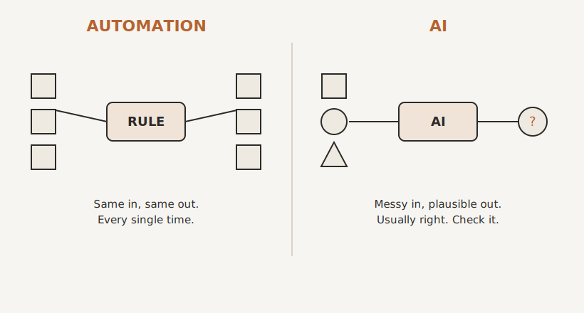

# AI Is Not Automation

By the end of this chapter you will be able to tell, in seconds, whether a problem in your business actually calls for AI or whether it is a plain automation job wearing a fashionable coat. That sounds like a small distinction. It is worth more money than almost anything else in this book, because getting it wrong is the most common and most expensive mistake owners are making right now.

Let me start with the most useful thing I can tell you about AI, and it is not what the headlines say.

Most of the time, when someone tells me they need AI, they do not. They need automation, and they could have had it 10 years ago.

They come to me certain the answer is some clever piece of artificial intelligence, and then we look at the actual problem, and it is this. A person fills in a form and someone retypes it into the CRM by hand. An invoice goes out late because nobody remembered to send it. The same five questions get answered by email twenty times a week. None of that needs intelligence, artificial or otherwise. It needs a rule. It needs the boring, reliable plumbing that has existed since long before anyone outside a research lab had heard of ChatGPT. The AI is a distraction from the actual fix.

To see why that matters, you have to understand that automation and AI are two genuinely different tools, and they behave in opposite ways.

## One Runs on Rails. The Other Has Judgement.

Automation is deterministic. That is a long word for a simple, rather beautiful idea: it does exactly what you told it, the same way, every single time. If this, then that. A booking comes in, so the confirmation goes out, the calendar updates, and the welcome email sends. It will do that identically at two in the morning on a bank holiday and at two in the afternoon on a Tuesday, a thousand times in a row, without drama. It cannot improvise, and that is precisely the point. Automation is a train on rails. It only goes where the track goes, which is exactly what you want for the parts of your business that must happen the same way every time.  The beauty is that 

AI is different in kind, not merely in cleverness. AI is probabilistic. It does not follow a rule you wrote. It looks at what you have given it and produces the most plausible response. That is what makes it astonishing. Hand it a rambling email, a messy document, an hour of meeting notes, and it can read, understand and respond in a way no rule could ever have anticipated. But it is also what makes it dangerous if you misuse it, because "most plausible" is not the same as "correct." Ask it the same thing twice and you may get two slightly different answers. And every so often it will tell you something completely wrong with total, fluent confidence. AI is not a train on rails. It is a brilliant, fast, slightly overconfident new colleague who handles ambiguity beautifully and occasionally makes things up.

Hold those two pictures side by side, because the whole game is knowing which one a job needs.

{#fig-automation-vs-ai width=85%}

## Why You Reach for the Wrong One

Once you see the difference, the common mistake becomes obvious, and a little painful.

For rule-shaped work, the invoicing, the reminders, the data moving from one place to another, automation is not merely good enough. It is better than AI. It is more reliable, because it is deterministic. It is cheaper, often costing almost nothing to run. And you can trust it unattended, because it always does the same thing. Using AI for that work is like hiring a gifted improviser to read out a script, word for word. You are paying more for less certainty, and quietly introducing the small but real chance that one day it ad-libs.

And yet the pull towards AI is strong, because AI is the thing in the news, the thing your competitor mentioned, the thing that feels like the future. That pull has a name worth saying out loud: fear of missing out. The fear is understandable, but it is aimed at the wrong target. The thing you genuinely cannot afford to miss is not AI in particular. It is the broader shift we have been circling since the first page: businesses deciding, deliberately, what belongs to a human, what to automation, and what to AI. If you skip straight to buying AI because it is fashionable, while your real bottleneck is a form that still gets retyped by hand, you have spent money on the wrong layer and your actual problem is still sitting there, untouched.

Remember the fax machine. Sending a fax from an email was automation, decades ago, and nobody called it intelligent. Software has always been automation. AI is the newest, cleverest layer on that same long road. It does not replace the foundation. You still need the plumbing underneath, and for most businesses the plumbing is exactly where the fastest, surest wins are hiding.

## When AI Genuinely Earns Its Place

None of this is me being sniffy about AI. Used in the right place it is transformational, and it can now do things that were simply impossible a few years ago.

AI earns its place wherever the input is messy and varied and no fixed rule could ever cover it. Working out what a customer actually meant in a long, rambling message. Drafting a first version of a proposal, a reply, or a piece of content from rough notes. Turning a call, a thread, or a document into a useful summary. Reading two hundred enquiries and sorting them by what the person actually wants. Pulling the key figures out of a supplier's PDF that never looks the same twice. This is genuine judgement-on-messy-input work, the kind that used to land on a person's desk only because nothing else could handle it.

There is one more thing to know, and we will build a whole chapter on it later. AI is only as good as what it knows about your business. A brilliant new colleague who has read nothing about how you work will give you brilliant, generic answers. Give that same colleague your way of doing things, your tone, your history, your hard-won knowledge, and the output becomes genuinely yours. That is why the most valuable thing you can build is not a clever prompt. It is a place for your business's knowledge to live, that the AI can draw on. I call it your Keystone, and we build it in Part Three.

## A Test You Can Use Today

Here is the whole chapter boiled down to a question you can ask out loud.

Could I write this down as a clear set of steps that works every time? If yes, it is automation. Build the rule, trust it, and walk away. If you cannot write the rule, but a sensible person could do the job by reading, understanding and applying judgement, then it is a candidate for AI, with a human eye on it sized to what is at stake.

Get that line right and two good things happen at once. The boring, certain work becomes boringly certain, handled by automation that never wavers. And AI gets pointed only at the work it is uniquely good at, instead of being asked to do a calculator's job and occasionally getting it wrong.

Confuse the two and you get the worst of both worlds. AI doing rule-work breaks in clever, unpredictable ways. Humans doing rule-work become the bottleneck we spent Part One escaping. And money spent on fashionable AI, while the real automation gap goes unfixed, buys you a headline instead of a solution.

You now know what AI is and is not, and where its line with automation falls. The next question is the practical one. How do you actually work with AI well? What is going on inside these things, what are they genuinely good and bad at, and how do you get useful work out of them without being caught out by their weaknesses? That is where we go next.

> **Try this.** Go back to the items you marked with a question mark in the last chapter, the fuzzy middle you were not sure about. Take each one and ask the test: could I write this as a clear rule? You will find that several of them, perhaps most, are not AI problems at all. They are automations you have simply never sat down to build. Move them into the automation column. The list of things that genuinely need AI is almost always shorter, and far less frightening, than it first looks.
