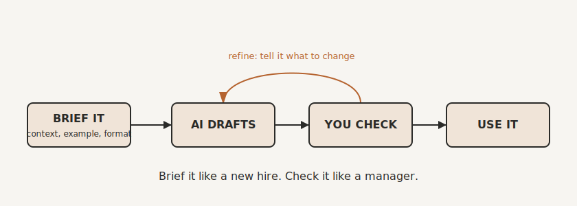

# Your Brilliant New Hire

By the end of this chapter you will know how to get genuinely useful work out of AI, and the method will feel oddly familiar, because it is almost exactly how you would manage a new member of staff.

That is the reframe that makes all of this click. The AI tools everyone is talking about, the ones you type into and they type back, are best thought of not as software but as a new hire. And not just any new hire. The keenest, fastest, most widely read recruit you have ever taken on. It has, in a sense, read more than any human could in a hundred lifetimes. It works in seconds. It never tires and never sulks. If you have ever onboarded a bright graduate, you already have most of the skills you need to manage it.

But this new hire has two peculiar quirks, and almost everything that goes wrong with AI comes down to forgetting them.

The first quirk: on day one, it knows nothing about your business. Nothing about your clients, your prices, your way of doing things, your history. It arrives brilliant, and completely blank about you.

The second quirk: every so often it will say something that is plain wrong, and it will say it with exactly the same calm confidence as when it is right. It does not knock on your door looking sheepish. It hands you the wrong answer with a smile.

Manage those two quirks and this is the most capable assistant you have ever had. Ignore them and it will embarrass you. So let me show you how to manage them.

## What It Actually Is (No Jargon)

You do not need the technical name or the science. But one simple idea will save you a great deal of grief.

These tools are, at heart, prediction engines. They have been fed an enormous amount of writing, and from it they have learned to produce the most plausible next words for whatever you give them. That is the trick, and it is a remarkable one. It is why they are so fluent, so good with language, so quick to draft and rephrase and summarise.

It is also why they sometimes make things up. When an AI does not know something, it does not stop. It produces what a confident answer would sound like, because sounding right is what it was built to do. It is not lying, and it is not looking anything up. It is predicting. Once you understand that, its strengths and its weaknesses stop being a mystery, and you stop being surprised by either. It is not a search engine. It is not a database. It is not a calculator. It is a very well-read colleague who is brilliant with words and occasionally too sure of himself.

## What It Is Brilliant At

Point this new hire at anything shaped like language and it will amaze you. Turning your rough, bullet-pointed thoughts into a clean first draft. Rewriting something stiff so it sounds like a human wrote it. Summarising a long thread, a document, or a meeting into the bits that matter. Explaining something complicated in plain English. Brainstorming twenty options when you are stuck for one. Changing the tone of a message from blunt to warm, or from waffly to sharp. Drafting the reply, the proposal, the job advert, the policy, the awkward email you have been avoiding all week.

Notice what these have in common. They are first drafts and transformations of language, the kind of work that used to eat hours and only ever needed a competent pair of hands, not your specific genius. That is the sweet spot.

It's also remarkably good at design.  It didn't used to be.  But the modern itterations from the big players can do things with powerpoint that you wouldn't believe.  They can give you four varients of a logo, which almost always are on the money.  They can not only design

## What to Keep an Eye On

The same tool has clear weak spots, and they are simply the flip side of how it works.

It does not know your business, so anything that depends on your specifics has to be given to it. It can be confidently wrong, so anything where the facts matter, the numbers, names, dates, legal or financial points, the claims you will put in front of a client, must be checked by a human before it goes out. It is surprisingly poor at precise arithmetic, because it is predicting plausible figures rather than calculating, so do not trust it to do your sums. And by default it does not remember your last conversation, so it starts fresh each time unless you give it the context again.

None of these are reasons to avoid it. They are simply the things a good manager keeps an eye on.

## How to Get Great Work Out of It

Here is the method, and every part of it is something you would do instinctively with a new member of staff.

Brief it properly. A vague request gets a vague result. Do not say "write me a proposal." Give it the context a new hire would need: who the client is, what they asked for, what you want to say, what a good one looks like. The more you give it, the better it does, every single time.

Show it an example. The fastest way to get what you want is to hand over one you are happy with and say, "another like this." Exactly as you would show a new starter a model of good work rather than describing it in the abstract.

Be specific about the result. Who it is for. How long. What tone. What format. The clearer the picture in your head, the closer the first attempt will land.

Treat the answer as a draft, not a verdict. This is the big one. You would never let a new hire's first effort go straight to a client unread. The same applies here. Delegate the work, then check it, exactly as a manager does.

Have a conversation. The first reply is the start, not the end. Tell it what to change. Sharper, shorter, warmer, drop that bit, add this. It will happily go again, and again, without ever taking offence.

And two rules that matter. Verify anything that carries risk before it leaves the building. And never paste in anything confidential that you would not hand to a stranger, because you cannot always be sure where it ends up.

There is a tidy way to remember the whole method: brief it like a new hire, and check it like a manager. Do that, and you will get more out of these tools than ninety percent of the people using them.

{#fig-brief-check width=85%}

## The One Thing Holding It Back

You will have noticed a thread running through this chapter. The single biggest limitation of your brilliant new hire is that first quirk: it does not know your business. Every time you use it, you find yourself pasting in the same background, the same context, the same "here is how we do things." It works, but it is tedious, and it means the quality depends on you remembering to feed it.

There is a better way. Instead of briefing it from scratch every time, you can give it a permanent, shared memory of how your business works, that it draws on automatically. That memory is the most valuable thing you will build in this entire book, and it has a name: your company's second brain, your Keystone. We build it in Part Three.

One practical note. There are several of these AI tools, and they come and go and leapfrog each other constantly. The specific ones, and how they compare, live in the tools directory at the back of the book, kept separate precisely because they change so fast. Everything in this chapter is deliberately about the principles, which do not.

For now, you have the three tools of the triage, and you know how to wield the trickiest of them. The only question left before we start building is the most practical one of all: with so much you could do, where on earth do you start? That is the next chapter.

> **Try this.** Take one task from your AI column and brief it properly, just once. Instead of a one-line request, give it three things: the context (who and what it is for), an example of good (one you are happy with), and the format you want back. Compare what comes back to what a lazy one-liner would have produced. That gap is the whole skill.
