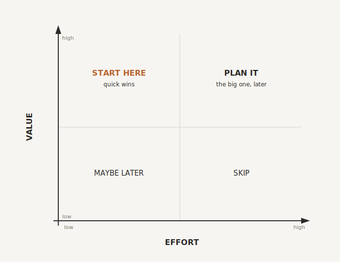

# The 80/20 of Where to Start

By the end of this chapter you will have chosen the single first thing to fix, and you will have a simple rule for choosing every one after it. No more standing in front of a mountain of possibilities, wondering where to dig.

Because that is the real danger at this point. You can now see your business clearly, perhaps for the first time. You have a list of everything that bottlenecks through you, and you have sorted it into human, automation and AI. That clarity is powerful, and it is also where a lot of owners freeze. The list is long. It all looks important. Everything could be improved. So, overwhelmed by the size of it, they do nothing. Or worse, they try to fix everything at once and collapse under the weight.

The way through is older than any technology, and it is one of the most reliable rules in business.

## The Vital Few

Roughly eighty percent of your results come from twenty percent of your efforts. You know this already. The same lopsided truth runs through your inefficiencies: a small handful of broken or manual processes cause most of the pain, most of the wasted hours, most of the dropped balls. The art is not to fix everything. It is to find the vital few and start there.

The good news is that you have already done most of the spadework. The bottleneck list you made in Chapter One, the one you triaged in Chapter Three and tidied in Chapter Four, is your map. Everything you tagged as automation, every "if this, then that" you could write as a rule, is a candidate. You are not staring at a blank page. You are standing in front of a list you already made, deciding which item to pick up first.

So how do you choose?

## Score by Value and Effort

Take each automation candidate and place it on two simple scales.

Value: how much would fixing this give back, in hours, in money, in errors avoided, in stress removed? Effort: how hard is it to set up, in time, money and fiddle?

That gives you four corners, and each corner tells you what to do.

**High value, low effort.** This is the gold. The quick wins. Enquiries that capture themselves, reminders that send on their own, the confirmation that goes out the moment someone books. Start here, always. Not because these are the biggest prizes, but because they are the fastest proof, and proof is what you need most right now.

**High value, high effort.** Worth doing, but not first. These are the bigger builds: the full onboarding flow, the proper join-up between your systems. Note them down as the flagship projects, and come back when you have momentum and a few wins behind you.

**Low value, low effort.** Nice to have. Do them if you are in the mood, but never let them crowd out the big hitters.

**Low value, high effort.** Leave them. This corner is where good intentions go to die, where people spend a month building something clever that saves twenty minutes a year.

One more filter on top: risk. A high-value automation that can fail loudly, invoices sent to the wrong client, say, is worth approaching with care. Start in the high-value, low-effort, low-risk corner, build your confidence there, and level up from a position of strength.

{#fig-value-effort width=80%}

## Marginal Gains, Not a Big Bang

Here is the principle I want you to hold onto above all the grids and scores, because it is the one that actually gets businesses unstuck.

Pick one painful thing. Fix it permanently. Then repeat.

That is it. Not a six-month transformation programme. Not automating five departments at once. One painful thing, fixed properly so it never has to be done by hand again, then the next, then the next. Each fix hands you back a little time and a little proof, and you spend both on the one after it. This is how a business changes without grinding to a halt, the same way a cyclist wins not with one heroic effort but with a hundred small improvements that compound. The owners who try to boil the ocean burn out and abandon the whole idea. The owners who fix one thing a fortnight wake up a year later running a noticeably different business.

It also quietly answers the objection in the back of your mind right now, the one that says "I do not have time for a big project." Good. You do not need one. You need one painful thing and an afternoon.

## What to Protect

Before you automate anything, a warning, because automation has a dark side when it is pointed at the wrong work.

Some things must stay human, and you already know which, because you tagged them in the triage. Do not automate the personal check-in with a client. Do not automate an apology when you have let someone down. Do not automate praise for your team, or the culture will quietly rot from the inside. If the outcome depends on trust or emotional intelligence, it stays with a person. This is "do what only you can do," applied with a scalpel.

Two more rules save a great deal of pain. Do not automate a mess: if a process is confusing, automating it simply hides the confusion behind a wall of software and makes it run faster. Clean it up by hand first, make it simple, then automate the simple version. And never automate something you cannot explain on a whiteboard in under two minutes. If you do not understand it, you cannot fix it when it breaks, and one day it will.

A bad process, automated, is just a bad process that runs faster.

## Your First Win

So, concretely. Look at your high-value, low-effort, low-risk corner and pick one. Or, if you are feeling bold, pick three, no more. The best first candidates share three traits, which are exactly the marks of the automation column from the triage: they are frequent, you do them at least weekly; they are repetitive, the steps barely change; and they are rules-based, if this happens, then that should happen.

For most service businesses with a team, the low-hanging fruit lives in the same four places. Capturing and following up leads, so that none ever dies quietly in an inbox. Scheduling, so the calendar ping-pong simply stops. Onboarding new clients, so every one gets the same smooth start without you sending a single PDF. And reporting - capturing and presenting information about what's going on in the business.  Any of these will hand you back hours in the first week.

That is your beachhead. You are not trying to fix the whole business this month. You are trying to reclaim five to ten hours a week and prove, to yourself and to your team, that this works. Once you have that, everything after it is easier.

## Keep It Lean

The fastest way to kill your own momentum is to overbuild. So work to constraints, because constraints force focus.

Define done before you start, in a single sentence. "When someone fills in our contact form, they get a confirmation, a reminder, and their details land in our system." If it is not in that sentence, it does not get built, not yet. Give the build a time box: an afternoon, not a month. Set a small monthly ceiling on tool costs, and resist anything that needs a developer and custom code. Get the first step working flawlessly before you add a second, because you are building a ladder, not a spider's web. Then test it like a pessimist: it is not done when it is built, it is done when it runs ten times out of ten without you touching it. And write it down, a few lines noting what sets it off and what it does, so that when something breaks one day, and one day it will, you have a map.

A short story shows both the danger and the cure. A marketing agency owner set out to automate his proposals. The plan was simple: when a lead enquires, generate a clean proposal and send it. Within a week the plan had bloated into a twelve-step monster with automatic pricing, conditional templates, AI-written copy and an alert for every proposal sent. Nothing launched. When he finally cut it back to what he actually needed, a clean proposal, sent fast, with no manual work, it was live in ninety minutes and saved six hours a week. That is the whole lesson. Do not let the perfect kill the profitable.  You can always improve it later.

The specific tools you might use for any of this are listed and compared in the directory at the back of the book, kept there because they change far faster than the principles do.

## Be Selfish

When choosing your first candidates to automate, it's tempting to dive into things that 

## From Thinking to Building

Take a breath and look at how far you have come. You understand why you became the bottleneck, and the shift out of it. You have a way to sort every task into human, automation or AI. You know how to get real work out of AI. And now you know exactly where to start, and how to keep it lean.

That is the end of the thinking. Part Three is where we build.

And we begin in the one place that makes everything else work harder. Before the automations, before you point AI at anything, there is a foundation most businesses never lay: a single, living memory of how your business actually runs, that your people and your AI can both draw on. Without it, you brief your brilliant new hire from scratch every time, and your systems each hold a fragment of the truth and none of them the whole. With it, everything you build stands on solid ground. It is called your company's second brain, your Keystone, and it is where we go next.

> **Try this.** Take your triaged list and look only at the automation column. Give each item two quick scores out of five, one for value and one for effort. Find the one with the highest value and the lowest effort, and circle it. That is your first build. Now write its done sentence: one line describing exactly what should happen, with no input from you. You have just gone from a vague "I should automate things" to a specific, finishable first project. That is the hardest step, and you have taken it.
