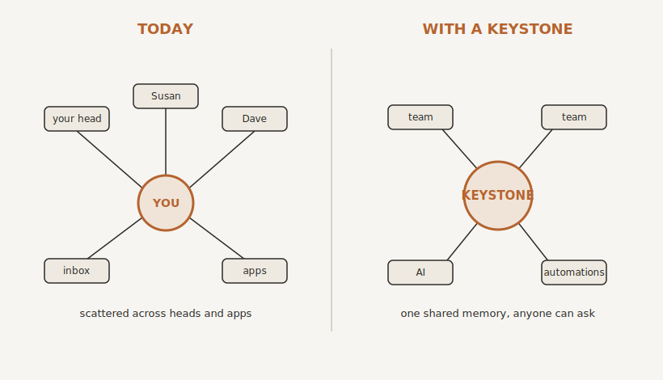

# Keystone: Your Company's Second Brain

By the end of this chapter you will understand the single most valuable thing you can build in your business, and why everything else in Part Three depends on it. I have been pointing at it since Part Two. Here it is.

## The Asset in the Worst Possible Place

Let me take you back to the thought that arrives at two in the morning, the one from the very first pages. If I stepped away, this would fall over. We can now say exactly why that thought is true, and it is not because you are disorganised. It is because the most valuable asset in your business is stored in the worst possible place: inside human heads.

How a deal actually gets done. Why that one client always needs handling a certain way. The reason you quietly stopped using that supplier. The unwritten knack that keeps a fiddly process from falling over. Most of it lives in your head. Some of it lives in Susan's, and some in Dave's. Almost none of it is written down anywhere a new starter, a machine, or a buyer could ever find it.

This is why people keep coming to you. Not because they are incapable, but because you are the only place the answer lives. The bottleneck you have been trying to escape is, underneath, an information bottleneck. The knowledge funnels through you because it is only stored in you.

It is also why the business is hard to sell for what it should be worth. A buyer looks under the bonnet and sees that the engine is a person who would quite like to leave. And it is why losing a good member of staff feels like an amputation. They do not just take a role with them. They walk out with a piece of the company's knowledge that existed nowhere else.

Everything else in this book helps with the bottleneck. This is the thing that fixes it at the root.

## What It Is, and Why It's Called Keystone

A company second brain is a single, living, organised memory of how your business runs, that both your people and your AI can ask.

Every word there is doing work. Single: one place, not seventeen. Living: it grows and stays current, instead of going stale. Organised: structured so an answer can actually be found, not a heap of files. A memory of how your business runs: not just documents, but the how and the why, the knowledge that today lives only in heads. And that both your people and your AI can ask: it serves humans and machines from the same source.

It is the piece that holds everything else up, the stone at the very top of an arch that stops the whole structure falling in. The keystone. Which is exactly why, ever since I first mentioned it, I have called it that. Your Keystone.

And here is the part that makes it powerful. There is not one Keystone. There are several, and they nest.

You have your own personal Keystone. Your private thinking space: your half-formed ideas, your candid read on people and situations, the strategy you are not ready to share. That is yours, and it stays yours.

Each of your team can have their own Keystone too. Here is the clever bit. It is technically owned by the company, but it feels like theirs, because its whole job is to make their working life easier. It remembers what they know. It drafts their replies. It answers the questions they would otherwise have to interrupt someone to ask. People look after a thing that helps them, which is exactly why this works when every shared drive and CRM you ever bought did not. Those failed because filling them in helped the business, not the person. A Keystone helps the person first, so it actually gets used.

Then there is the company Keystone, the master. The shared memory the business runs on, that all the personal ones feed into. Each person controls a membrane: what flows up from their private Keystone into the company's, and what stays private. The company never gets everything in anyone's head. It gets only what the business genuinely needs to run, the operational knowledge that should never have been locked inside one skull in the first place.

Sit with what that does, because it is bigger than it looks. Today, when a good member of staff leaves, their knowledge walks out of the door with them. If that same person has spent two years quietly building their Keystone, the knowledge stays, because the Keystone is the company's. You have just extended the cure for key-person dependency from yourself to every single person you employ.

Now picture your company's brain as it stands today. A bit of it is in your head. A bit in each of your team's heads. A bit in your inbox, some in the CRM, some in a folder, some in a chat thread from eight months ago. Nothing holds the whole picture, and the only thing joining it all together is you, walking around answering questions. A Keystone takes all of that and gives the business one shared mind to think with.

{#fig-second-brain width=90%}

## Why This Isn't the Documentation You've Tried Before

I know what you are thinking, because you have been here. You have tried to write things down before. You started the process document, the shared drive, the wiki, the "how we do things" folder. And it died. Within months it was out of date, nobody trusted it, and everyone quietly went back to asking you.

So let me be straight about why this is different, because if it were simply "document everything," I would not spend a chapter on it.

Your old documentation died for two reasons, and a Keystone fixes both.

It died because keeping it current was a miserable human job that nobody wanted, so nobody did it. A Keystone is maintained by AI. As things happen in your business, a call, a decision, a change to how something is done, the AI does the tedious work of writing it up, filing it, cross-referencing it, and flagging where it now contradicts what was there before. The upkeep that killed every previous attempt is handed to a machine that never gets bored. You compile the knowledge once, and it is kept current automatically.

And it died because nothing depended on it. A document no one is required to use will always rot, because nothing keeps it honest. A Keystone is different because everything draws on it. Your team asks it instead of asking you. Your AI reads from it before drafting anything. Your automations act on it. Because it is used, constantly, it stays alive and earns its keep. It is not a record you file and forget. It is the thing the business runs on.

## Roughly How It Works

Underneath, it is simpler than it sounds, and it has three parts.

There are the raw sources: the actual stuff of your business as it happens, the calls, the documents, the decisions, the messages. There is the Keystone itself: an organised, written memory that the AI builds and maintains from those sources, in plain language, structured so anything can be found. And there is the way everyone draws on it: your people and your AI both ask it questions and get their answers from the same single source of truth. You are not chained to a keyboard typing it all up. Your job is to feed it and to steer it. The machine does the filing.

There is one catch worth naming now and solving in the next chapter. A great deal of what should go into the Keystone has never been written down at all. It lives as habit, as instinct, as "I just know." Getting it out is a craft of its own: digging beneath what people say they do to what actually happens, click by click and decision by decision. I call it Process Archaeology, and it is how you excavate the knowledge currently buried in heads. We will do it properly in the next chapter. For now, simply notice how much of your business has never once been said out loud.

## Why It Comes First

This is why your Keystone is built before a single automation, before you point AI at anything. Three things change the moment you have it.

First, it gets the business's knowledge out of your head and into something that does not leave, does not forget, and does not get hit by a bus. The 2am fear loses its teeth, because the business no longer depends on your memory. Lose a key person and you lose a colleague, not a chunk of the company's mind. And the business becomes something you could genuinely sell, because what a buyer is now buying is a documented, working system rather than a job with your name on it.

Second, it dissolves the information bottleneck. When the knowledge is shared, the questions stop arriving at your desk, because for the first time the answer exists somewhere other than your head. The very thing that made you the bottleneck quietly disappears.

Third, and this is what makes the rest of the book work, it is what finally makes your AI and your automations genuinely yours. Remember your brilliant new hire, who knew nothing about your business and had to be briefed from scratch every time? Your Keystone is the memory you give it, so it turns up already knowing how you work, in your tone, with your history. And every automation you build draws on the same single source of truth, instead of each one clutching its own little fragment. Without it, your AI is generic and your automations are scattered. With it, everything you build stands on the same solid ground.

That is why we lay this foundation first. Everything in the chapters that follow gets better the moment it has a Keystone to draw on.

## Where We Go Next

So that is what a Keystone is, and why it is the most valuable thing you will build. The obvious question is the practical one. How do you actually build it, fill it, and keep it alive without it becoming yet another job you do not have time for? That, including the excavation work of Process Archaeology, is the next chapter.

> **Try this.** Write down three things that, if you vanished tomorrow, only you would know. The real reason a major client stays. The workaround that keeps a fiddly process running. The supplier you would never use again, and why. Those three lines are the first entries in your Keystone, and proof of how much of this business currently exists in exactly one place: you.
