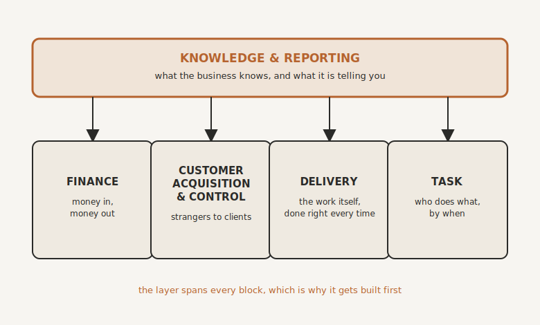

# The Map of Your Business

By the end of this chapter you will be able to draw your entire business on one sheet of paper, and you will understand why that single drawing will do more to cut your costs, your risk and your mental load than any tool you could buy.

## Four Blocks

Strip away the detail, and every service business, yours included, runs on the same four building blocks.

**Finance.** Money in and money out. Invoicing, taking payments, the bank, the bookkeeping, the payroll.

**Customer Acquisition and Control.** How strangers find you, how enquiries become clients, and where those relationships live. Your marketing, your website, your booking, your pipeline, your customer journey.

**Delivery.** The work itself. How the thing you sold actually gets done, to standard, on time, every time.

**Task.** The day-to-day doing. Who is doing what, by when, and what happens when it is finished. And not only the client work: running the payroll, the actions from the last management meeting, planning the Christmas party, the birthday present for a member of staff, and the aspirational tasks that never quite reach the top of the pile, the new product line, the next evolution of the strategy. The work list of the business, all of it.

That is the whole machine. Every job in your business, every process you run, every tool you pay for belongs inside one of those four blocks. If something does not fit in any of them, question whether you need it at all.

And there is one more piece, and it is deliberately not a block.

## The Layer Over the Top

Laid across all four blocks is a layer: **Knowledge and Reporting**. What your business knows, and what your business is telling you.

Every block produces knowledge, the how and the why of the way you work, and every block produces data, the numbers that say what is actually happening. But that knowledge and that data do not belong to any single block. The layer spans all of them, and that is precisely why we will build it first. Its memory is the Keystone, which is the very next chapter. Its eyes, the dashboards that tell you the truth about your business at a glance, come later in the book, once there is a running machine to watch.

{#fig-four-blocks width=90%}

Hold this picture in your head from here on. The rest of this book is simply building it: the layer first, then each block in turn, until the whole machine runs without you standing in the middle of it.

## Now Draw Yours

Here is the exercise, and I want you to actually do it, because what it reveals surprises almost every owner I have done it with.

Draw the four blocks on one sheet of paper. Then, inside each block, write the name of every tool you pay for or log into to run that part of the business. All of them. The subscriptions line on your bank statement is a good memory aid, but do not stop there: include the free tools, the website and the company that hosts it, the plugins, the spreadsheet that quietly runs half a department.

Your Finance block will probably look reassuringly tidy. For most businesses it is three or four pieces: the accounting package, the business bank account, something collecting direct debits, something taking card payments. Rarely more. Finance is tidy because consolidation already happened there, years ago. Accountants, banks and regulators forced the industry to grow up, and now everything talks to everything and one login shows you the truth.

Now look at your Customer Acquisition and Control block. For a typical business it is carnage. Mailchimp for the newsletter. Pipedrive for the deals. Calendly for the bookings. Google Ads for the traffic. WordPress for the website, and another company hosting it. Hotjar to see what visitors do. ClickFunnels for the landing pages. Buffer or Hootsuite to schedule the social posts. ManyChat to answer the social messages. Expandi to run the LinkedIn campaigns. Kajabi for the course. Skool for the community. And X, where the posts still go out by hand. No tool, no system, but it earns a box on the map all the same, because a box is not a piece of software. A box is anything the business does.

Every one of them was bought, or begun, on a different day, by a person solving a real problem, and every one was a perfectly reasonable decision at the time. Fourteen boxes, a dozen logins, a stack of monthly charges, and not one of them talking to the others.

## SaaS Spaghetti

I have a name for what you have just drawn: **SaaS Spaghetti**. A tangle of subscription software, bought one strand at a time, that nobody ever designed. A million subscription costs, a million points of failure, and nobody, including you, fully understands how it works, or how it is even supposed to work.

Spaghetti is expensive in the obvious way, and the audit usually finds a few hundred pounds a month going to tools that overlap or that nobody has opened since spring. But the deeper costs are the ones that never show on a statement. Every strand is another login and another dashboard competing for space in your head. Every join between two tools is a place where a lead, a booking or an invoice can silently fall through. And every tool holds its own little fragment of the truth about your clients, which is exactly why nobody in your business can ever see all of it.

When something breaks, and in a tangle like this something always breaks, whose job is it to notice? Which strand failed? The honest answer in most businesses is that nobody knows, and that the fault is found days later, by a client.

## The Mess Is Not What Gets Automated

Now the principle this chapter exists to plant, before you build a single automation in the chapters ahead.

You do not automate the spaghetti. Spaghetti, automated, is still spaghetti. It just moves faster, breaks in more places, and costs more while it does it. The last chapter warned you never to automate a messy process. The same law applies to tools: simplify first, or simplify as you go, but never pour automation on top of a tangle and hope.

Simplifying usually means consolidating: collapsing many single-purpose tools into fewer, better-connected homes, ideally one home per block. This is most dramatic in the Acquisition and Control block, where a whole class of all-in-one client platforms built for small businesses can replace half the strands on your map in one move, and, because everything then lives in one place, power every automation you will want later. Which platform is a question for the tools directory at the back of the book, because the names change. The map does not.

Notice, too, what this chapter has not needed: AI. If you are not ready for AI yet, or your team is not, this map is still a full step forward on its own. Fewer subscriptions, fewer points of failure, less mental load, and one drawing that finally shows you how your business is supposed to work. And when you are ready to automate, the map becomes your wiring diagram. You will know exactly what plugs into what, because you designed it that way.

## Where We Go Next

You now have the plans: four blocks, a layer over the top, and an honest picture of the tangle each block holds today. We build the layer first, because it is the only piece that touches everything else. A single, living memory of how your business actually runs, that your people and your AI can both draw on. It is called your company's second brain, your Keystone, and it is where we go next.

> **Try this.** One sheet of paper, four blocks: Finance, Customer Acquisition and Control, Delivery, Task. Inside each, write every tool you pay for or log into, then add up two numbers: the monthly cost, and the count of boxes. Circle the most crowded block. That circle is where consolidation will pay you back first, and you have just drawn the wiring diagram for everything we build in Part Three.
