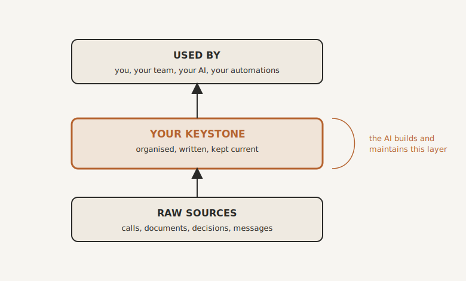

# Building and Maintaining Your Keystone

By the end of this chapter you will know how to build your Keystone, how to fill it, including the knowledge that currently lives only in people's heads, and how to keep it alive, all without it becoming yet another job you do not have time for. That last part matters most, because it is where every previous attempt died.

## Start Small, Then Grow It

First, a relief. You do not build a Keystone all at once. The thought of capturing everything your business knows in one go is paralysing, and paralysis is exactly what we are trying to escape. So we do not.  (Indeed, we _could_ not.)

You already know the rule from Chapter Six. Pick one painful thing, fix it permanently, repeat. The same applies here. You seed the Keystone with a little, then grow it one process at a time, as you go. The very first entries are the things you wrote down at the end of the last chapter, the handful of things that, if you vanished, only you would know. That is your starting point. Everything else accretes from there.

## What It's Actually Made Of

Strip away the mystique and a Keystone has three simple layers.

At the bottom are the raw sources. This is the evidence of how your business actually runs: emails, recordings of calls, documents, decisions, messages, notes. You do not tidy these. They are the raw material.

In the middle is the Keystone itself. This is an organised, written memory, built and kept current by AI from those raw sources, in plain language. Think of it as a set of living pages: a page for each important client, each supplier, each member of the team, and a page for each process, how we onboard, how we quote, how we handle a complaint, plus a running record of the decisions you have made and why. Structured so that anyone, or any AI, can find an answer in seconds.

At the top sits a short rulebook. A page or two that tells the AI how your Keystone is organised: what goes where, what your conventions are, what tone to write in. This is the quiet secret that turns the AI from a random note-taker into a disciplined librarian. You and it shape that rulebook together over time, as you learn what works for your business.

That is all it is. Not a frightening enterprise system. At its simplest, a well-organised set of plain documents that an AI looks after. The specific tools you might use to hold it live in the directory at the back, because they will change. The shape will not.

{#fig-keystone-layers width=80%}

## Getting It Out of Heads: Process Archaeology

Here is the hard part, and the part nobody else will tell you how to do. Most of what should go into your Keystone has never been written down, because it does not live as words. It lives as habit and instinct. Ask someone how they do their job and they will give you the official version, the tidy three steps. Then watch them actually do it and you will see fifteen, full of little judgements, exceptions and workarounds they no longer even notice. The gap between what people say they do and what they actually do is exactly where the valuable knowledge is buried.

Digging it out is a craft. I call it Process Archaeology, and the single most important rule of it is this: do not write it up yourself. If capturing knowledge means sitting down to type documentation, it will never happen, because you are busy and it is dull. That is what killed every attempt before.

Instead, you capture it raw and let the AI do the writing. The method is simple. Take one process and find the person who really does it. Ask them not to explain it, but to do it, out loud, while you record. A screen recording, a voice note, a transcript of them talking through it, any of these will do. As they work, they narrate: "right, first I open this, then I check whether the client is new, because if they are there is an extra bit, oh, and I always double-check that, because one time it caught us out." That aside, the one they almost skipped, is the gold. So you ask for it directly. What do you do when it goes wrong? What is the bit you would warn a new starter about? What does everyone get wrong?

Then you hand that raw recording to your AI and ask it to write it up as a clear how-to and file it in the Keystone. The person's job was to talk and to show. The machine's job was to listen, write, and organise. Nobody had to sit and type a document, which is the only reason it actually got done.

Picture Susan, who has run your client onboarding for years and holds the whole thing in her head. An afternoon of Susan talking through three real onboardings while you record, fed to the AI, gives you a clean, complete onboarding process in the Keystone, exceptions and all. Susan's knowledge is no longer trapped inside Susan. And Susan, as it happens, rather enjoyed being the expert for an afternoon.

## Feeding It Every Day

Process Archaeology gets the big buried processes out. After that, most of the feeding happens almost on its own, from the ordinary exhaust of the business.

Your days already produce a steady stream of raw material: meetings, emails, client calls, decisions made in a Slack thread, a change to how something is done. Point your AI at that stream and it writes the relevant parts into the Keystone as they happen, updating the right pages and noting what changed. A decision made on a Tuesday becomes, without anyone setting out to document it, a line on the right page that everyone can see. Your job shrinks to two things: feeding it the sources, and steering it when it files something in the wrong place. The Keystone grows richer as a byproduct of you simply running your business.

## Using It Is What Keeps It Alive

Now the part that solves the problem that killed every wiki you ever started. A Keystone does not rot, because everything draws on it, constantly.

Your team asks it instead of asking you. Your brilliant new hire, the AI, reads from it before drafting anything, so its work arrives already sounding like you. The automations you are about to build act on it. And because it is used all day, every day, its mistakes surface in the flow of work and get corrected on the spot. A wiki nobody opens drifts quietly out of date. A Keystone the whole business leans on is kept honest by being leaned on. Using it and maintaining it become the same activity.

## Maintaining It Without a New Job

So what is actually left for a human to do? Less than you fear.

The AI does the continuous upkeep: the writing, the filing, the cross-referencing, the flagging of things that now contradict each other. What remains is a light rhythm, not a burden. Once a week, or once a fortnight, you spend a short while looking at what the AI has flagged: a contradiction it spotted, a gap it noticed, a decision that needs your confirmation. You confirm or correct, and it carries on. That is the whole maintenance job. The heavy lifting that buried every previous attempt is now done by a machine that does not get bored, and the part left for you is small precisely because the machine does the rest.  

## Getting Your Team on Board

A word on the people, because this only works if they take to it.

The good news is that you are not asking them to fill in another system that helps the business but not them. You are giving each of them a Keystone of their own that makes their day lighter: one that remembers their stuff, drafts their replies, and answers the questions they would otherwise have to chase someone for. People look after a tool that looks after them. So roll it out as a gift, not a mandate. Go first yourself, so they see you using yours. Start with one keen or badly overloaded person, get them a visible win, and let it spread by people wanting what their colleague has, rather than by decree.

And here is the honest part. Most of your team, once they feel it making their own work easier, will take to it quickly. A small number will resist, as some people resist any change at all. Do not turn that into a fight. But do notice it, gently, for what it often is. A business learning to work this way is heading somewhere, and a person who refuses, on principle, to let anything they know be written down or shared is quietly telling you they may not want to go there. That is not a reason to be heavy-handed. It is simply something worth seeing clearly.

## The Foundation Is Laid

Take stock. You now have, or know how to build, the single most valuable thing in your business: a living memory it shares, that gets what is in everyone's heads out where it is safe and useful, and that your people and your AI can both draw on. That is the foundation. From here, everything we build sits on top of it and works better for it.

And now we start building in earnest. The first move is to get your tools talking to each other, so that work begins to flow from one place to the next without you carrying it between them by hand. That is automation, and it is the next chapter.

> **Try this.** Pick one process that only one person knows, perhaps even you. Record that person doing it once, narrating as they go, including the bit about what they do when it goes wrong. Hand the recording to your AI and ask it to write it up as a clear, step-by-step guide. Read what comes back. You have just made your first real Keystone entry, taken a process out of a single head, and proved the whole method, in under an hour, without typing a word of documentation.
