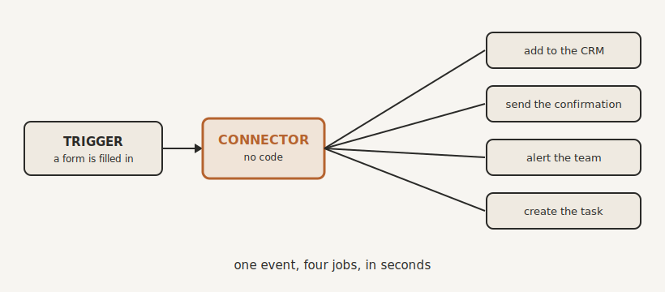

# Connecting Everything: Automation Without Code

By the end of this chapter you will understand how to make the tools you already own work together automatically, with no code and no developer, so that work flows from one to the next while you sleep.

## The Glue You're Missing

Here is a quiet truth about your business. The problem is rarely the tools. You probably already have a form on your website, a calendar, a CRM of some kind, email, an accounts package. Decent tools, most of them. The problem is that they do not talk to each other.

So someone has to carry the information between them by hand. A lead fills in the form, and a person copies the details into the CRM. A client books a call, and someone types it onto the calendar and into the client record. An invoice is needed, so the same numbers get keyed in again. Every one of those handoffs is a person doing a machine's job, and more often than not, that person is you. You are the glue holding your tools together. You are the integration layer.

The fix is a connector. A connector is a piece of no-code software whose only job is to pass information between your tools and tell them what to do. You set the rules once, by clicking rather than coding, and from then on the connector does the carrying. It is, in effect, the first member of your digital back office, and it never sleeps, never forgets, and never fat-fingers an email address.

## When This Happens, Do That

The whole idea fits in one line. When something happens in one tool, do something in another. The first half is the trigger (something happens). The second half is the action (do something).

Say a new enquiry lands through your website form. That is the trigger. From that single event, the connector can, in the space of a few seconds, add the person to your CRM, send them a warm confirmation so they know they have been heard, ping your team so someone can pick it up, and create a task assigned to your team so it cannot be forgotten. One thing happened, and four jobs got done, correctly, instantly, and without a human lifting a finger.

That is the heart of it. One trigger, a chain of actions. Now multiply it by every enquiry, every booking, every invoice, and the hours begin to stack up.

{#fig-connector width=90%}

## Making It Smart

A connector that only ever does the same thing is useful. A connector that can make simple decisions is transformational, and you can give it three kinds of judgement without writing a line of code.

The first is a filter, a gatekeeper that decides whether the chain should run at all. Only follow up the enquiry if it actually left a phone number. Only alert the team if the postcode is in your area. The filter quietly stops you wasting effort on the things that do not deserve it.

The second is a branch, a fork in the road. If the person ticked "ready to buy," send them straight to your booking link. If they ticked "just looking," drop them into a gentle nurture sequence instead. Same trigger, different roads, chosen automatically based on what the person actually did.

The third is a delay, simple control over timing. You do not always want everything to fire at once. A follow-up that lands the next morning often beats one that arrives four seconds after someone hits submit. A delay lets your business feel attentive rather than robotic.

Put those three together and your connector stops being a conveyor belt and starts behaving like a sharp receptionist who knows exactly where to send each caller.

## What It Can and Can't Do

Let me set expectations, because a connector is powerful but it is not magic.

It is brilliant at exactly the work you tagged as automation back in the triage: repetitive, rule-based, predictable. If you can describe the steps clearly, it can do them, flawlessly, forever. That is its sweet spot, and it is a large one.

But it does not replace judgement. It will not decide which leads are worth chasing, write your proposal, or handle the genuinely unusual case that needs a human. That work belongs in the other two columns of the triage. And, importantly, a connector does not replace your tools. It is the glue between them, not a substitute for them. It moves information and triggers actions. It is not your CRM, and it is not where your data lives.

Keep it to what it is for, and it will quietly run a large part of your business.

## Build It So It Doesn't Bite You

An automation running invisibly in the background is a wonderful thing, right up until it breaks silently and you discover a week later that no leads were followed up. So a few habits, which are really the lean discipline from Chapter Six applied here.

Name your automations like you would name a job. Not "Automation 14," but "New enquiry: CRM, confirm, alert, task." When you have twenty of them, you will be grateful.

Test before you trust. Run it with a dummy enquiry and watch every step fire before you let it loose on real clients. You would not push an untested change to your live website. Treat the machinery running your business with the same respect.

For each automation, consider having it log what it's doing so that a dashboard can agregate and display daily or weekly summaries.  This log will be invaluable over time.  You get
And build a failsafe. The simplest and most important one is this: if the automation ever fails, have it send you an alert. That single habit means you are never flying blind, and a broken automation becomes a two-minute fix rather than a silent month of lost leads.

## It Keeps Your Keystone Current

One last connection, and it is the one that ties this chapter to the last. The best automations do not only shuttle data between your apps. They also feed your Keystone.

When a connector files a new client, it can drop a note onto that client's page in the Keystone. When a deal closes or a decision is made, it can record it. So the same automations that save you time are quietly keeping your single source of truth up to date, without anyone writing anything down. Your connectors and your Keystone strengthen each other: the Keystone gives your automations a reliable place to read from and write to, and the automations help keep the Keystone alive.

## Where We Go Next

Look closely at the examples in this chapter and you will notice that one tool keeps appearing in the middle of them: the place your client relationships live. Your CRM. Most of your most valuable automations revolve around it, which makes it worth getting properly right, rather than letting it become the data graveyard you may have ended up with last time. That is the next chapter.

> **Try this.** Take the first automation you circled in Chapter Six. Write it out in plain words: "When this happens, do this, and this, and this." Then add two lines. One filter: when should it not run? One failsafe: how will you know if it breaks? You have just designed your first connector, and you did not write a single line of code.
