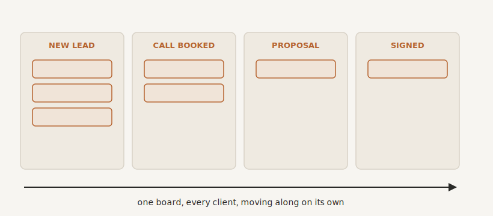

# Your Client Operating System

By the end of this chapter you will understand why every client relationship in your business needs one home rather than a dozen, and, just as importantly, how to make that home, your CRM, the thing your team actually uses this time, instead of the expensive graveyard it probably became last time.

## Death by a Thousand Logins

Look at how a single client currently moves through your business. The enquiry arrives in one tool, the form. The booking happens in another, the calendar. Their details get typed into a third, the CRM or the spreadsheet. The conversation lives in your inbox. The invoice sits in your accounts package. A note about them is on a sticky pad, or in your head. Maybe you also use a calendar booking tool to allow people to auto-book in.

Seven places, none of them talking to each other, and a human, usually you, carrying the client between them by hand. Every one of those gaps is a crack a lead can slip through, and most do not slip because anyone stopped caring. They slip because no single place was ever responsible for catching them.

There is also a quieter cost. Every extra tool is another login, another dashboard, another monthly subscription, another thing to hold in your head. The mental clutter of running your business across seven tabs is exhausting in a way that never shows up on any invoice. The answer is to give every client relationship one home: one place where every lead, every conversation, every booking, every deal, and every next step lives together. That home is your CRM, used properly. Think of it not as a database but as your client operating system, the hub the whole client side of your business runs on.

## See the Whole Business at a Glance

The first thing a proper hub gives you is something you have probably never really had: visibility.

At its centre is a pipeline, a simple visual board of every live opportunity and exactly where it stands. New enquiry. Call booked. Proposal sent. Signed. Every lead is a card that moves along the board as things happen. And the moment you log in, you are not looking at a list of names. You are looking at movement: what came in, what is progressing, what has gone quiet, what is about to close.

That is the cure for one of the most stubborn frustrations you have lived with, the sense that you can never quite see what is going on or forecast what is coming. With a pipeline in front of you, you can. You can tell, in ten seconds, the health of your business, where the jam is this week, and which three deals deserve a nudge today. Nothing falls through the cracks, because the board is the crack-catcher.

{#fig-pipeline width=90%}

## It Does the Chasing

Here is where the hub stops being a filing cabinet and starts being a member of staff.

Because everything lives in one place, the connectors from the last chapter finally have somewhere to plug in. The enquiry that arrives captures itself onto the board. The booking sends its own confirmation and reminders. The lead who goes quiet gets a gentle, automatic nudge. And my favourite small example, the one that pays for the whole thing on its own: the missed call. When you cannot pick up, because you are with a client or simply having your lunch, the hub can text the caller back within seconds. "Sorry we missed you. How can we help? You can book a time here." That single automation turns calls you used to lose straight to a competitor into conversations you keep.

This is the difference between a CRM that sits there and a client operating system that works. It standardises the follow-up you currently only manage when you remember, on the days you are not too busy. The system remembers for you, every time, in exactly the same reliable way. The deeper end of this, the behaviour-driven nurture and the marketing sequences, we will come to in Part Four. For now, the point is simply that the hub is where the automation lives.

## Why It Died Last Time

I have to address the elephant in the room, because you are probably sceptical, and rightly so. You have bought a CRM before. You set it up with high hopes, and within six months it had become a ghost town: half-filled records, out of date, nobody trusting it, everyone back to the inbox and the spreadsheet. So why would this time be any different?

Here is the truth that nobody selling you CRMs will tell you. It was never the tool. It was the process, and the adoption. And both are fixable.

The process first. A CRM dropped on top of a business that has never defined how a lead actually moves through it is just an empty database with hopeful column headings. So you design the process first. Map the real journey, the handful of stages a stranger passes through to become a paying client, and then shape the hub around that. The tool serves the process, not the other way around.

Then adoption, which is where most attempts truly die. Your last CRM did not get filled in because filling it in was dull manual work that helped the business and nobody in particular. So you fix that from both ends. You make it fill itself, by letting the connectors do the data entry, so a booking, an email, a form, all land on the board with nobody typing a thing. And you make it genuinely useful to the person who opens it, so it tells them who to call and why, drafts the reminder, creates the proposal, surfaces the answer, rather than demanding they feed it. A tool that does your typing and makes your day easier gets used. A tool that asks you to do its typing gets abandoned. That is the whole story of every CRM that ever failed.

One rule keeps you honest. If an ordinary, non-technical member of your team cannot do the thing they need in one obvious action, it will not get used. Design for that person, not for the power user. Simplicity is not a nicety here. It is the difference between adoption and another graveyard.

## The CRM and the Keystone

A quick word to head off a confusion, because you now have two important homes for information and they are not the same thing.

Your CRM, the client operating system, holds the who and the where. Who your clients and leads are, where each one is in the journey, what has passed between you. It runs the live relationships.

Your Keystone holds the how and the why. How your business does things, why decisions were made, the knowledge that used to live in heads.

They are partners, not rivals. The CRM moves the client along; the Keystone remembers how you do it well. Used together, they are the operational core of an automatic business: one runs the relationships, the other remembers everything.

## One Hub, Not Five

A closing piece of advice, and it runs against the instinct of every owner who loves a shiny new tool. Resist the sprawl. The whole benefit here comes from consolidation, from one place being responsible for the client side of your business. Every extra disconnected tool you bolt on chips away at that. Pick one client operating system and route everything through it. Which one is a question for the tools directory at the back, because the names change. The principle does not: one home, not seventeen.

## Where We Go Next

Your hub is now humming. Leads capture themselves, the board shows you everything, the follow-up runs on its own. Which raises the next question, the one that separates a business that merely moves fast from one people actually trust: is the work flowing through all of this correct, every single time? Consistency, and the quiet killing of errors, is the next chapter.

> **Try this.** On one sheet of paper, draw your pipeline: the five or so stages a complete stranger passes through to become a paying client. Then, beside each stage, write the single thing that should happen automatically the moment a lead lands there. You have just sketched the spec that turns a CRM from a filing cabinet into a client operating system.
