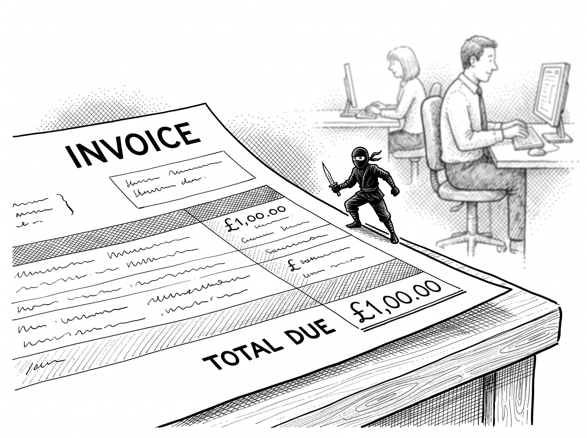
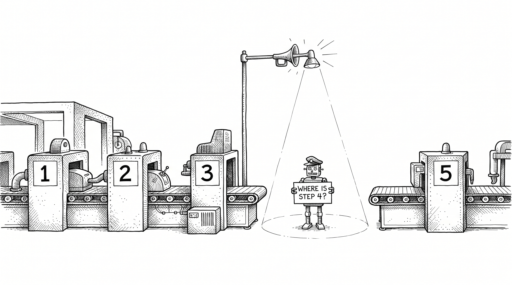
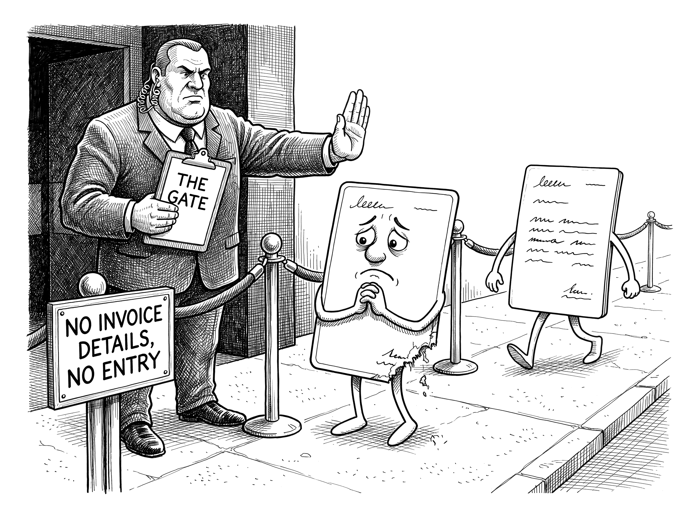

# Killing Errors: Accuracy and Consistency

> *"A bad system will beat a good person every time."*
>
> W. Edwards Deming

By the end of this chapter you will see why the small mistakes you barely notice are quietly costing you more than you think, and how to build a business where it is hard to get things wrong. Not because everyone is trying harder, but because the system will not let them.

## The Silent Assassin

Mistakes are not just embarrassing. They are expensive.

A miskeyed invoice means a payment that does not arrive. A forgotten follow-up loses a lead who was ready to buy. A double-booked slot throws a whole day into apology mode. None of these are "oops" moments. Each one is a small line item on your profit and loss, and the small ones add up. One or two a week sounds harmless, until you multiply it across the year and across everyone on your team.

But the real damage is the part you cannot see. Clients rarely tell you when they have lost a little confidence in you. They do not complain. They just, quietly, stop coming back, and recommend someone else instead. Every dropped ball spends a tiny bit of the trust you worked hard to earn, and you never get a receipt. Human error is the silent assassin of a service business, and most owners badly underestimate the bill.

::: {.content-visible when-format="typst"}
{fig-alt="A tiny ninja formed from a currency typo perches on an invoice corner with a dagger while the office works on, oblivious." width=60%}
:::
::: {.content-visible unless-format="typst"}
{fig-alt="A tiny ninja formed from a currency typo perches on an invoice corner with a dagger while the office works on, oblivious." width=60%}
:::

## Stop Trying to Fix People

Here is the useful pattern. These errors are not random. They happen in the same handful of places, over and over: manual data entry, scheduling, follow-ups, the handoff from one person to the next, billing. Notice what they have in common. They are low-value, high-risk, and rule-based. They are, in other words, exactly the work you tagged as automation back in the triage.

So when something keeps going wrong there, the instinct is to fix the person. More training. A stern word about being more careful. A new rule pinned to the wall. It almost never works, because the fault is not really in the person. It is in the structure. You are asking a tired human to do a repetitive, fiddly task perfectly, every time, forever, and humans are simply not built for that. They forget. They tire. They skip a step because they are rushing to beat the lunch queue. Or they just make a typo.

A machine does none of those things. It does not forget, does not tire, and does not have an off day. So the goal is not to train your people to stop making mistakes. It is to remove their hands from the places where mistakes are made. You are not trying to make people more careful. You are making it hard to get it wrong in the first place.

And this is not anti-team. It is the opposite. You are protecting your good people from being blamed for a structural fault, and freeing them to do the work that actually needs a human.

## Consistency Is the Real Prize

Fewer errors is the obvious win. The bigger one is consistency, and it is worth more than it sounds.

Think about a good hotel. You do not return because the towels were especially fluffy one time. You return because they are always fluffy. You know exactly what you will get, and that reliability is its own kind of comfort. Clients feel the same way about you. They are not just buying your service. They are buying the confidence that you will show up on time, keep your promises, and deliver the same quality every single time, whether or not you happened to be short-staffed that week.

Automation is the shortest path to that. It guarantees every client the same onboarding, the same follow-up, the same standard of care, regardless of who is on shift or how busy the day is. It raises your floor, not just your ceiling. And in a service business, that compounds into the most valuable asset you have, a reputation for being reliable. Reliability is what turns a client who tolerates you into one who refers you.

It helps your team, too. When everyone knows what is meant to happen and when, the firefighting and the finger-pointing fade. You give people a rhythm they can trust, and they stop bracing for the next dropped ball.

## The Keystone Sets the Standard

You may be thinking, did we not already try this? You wrote the procedures down once. The "how we do it" document. And it died in a folder, like every other one.

Here is the difference now, and it brings us back to your Keystone. The right way to do something lives in the Keystone, the living memory we built. The automation then makes that right way happen, the same way, every time, embedded in the actual flow of work rather than sitting in a document nobody opens. When a step needs doing, the instruction for doing it well is right there, attached to it. The standard is no longer something people are meant to remember. It is built into the machinery. It is, in effect, your best employee's way of doing the job, applied by everyone and everything, automatically.

## Make the System Police Itself

There is one more level, and it is what separates a tidy business from a genuinely dependable one. You do not only automate the steps. You build guardrails that catch the gaps.

The first is the missing-step alert. Mistakes usually come not from doing the wrong thing, but from forgetting to do something at all: the proposal that never got sent, the form half-filled and then abandoned. So you have the system watch its own processes. If a step that should have happened within a day has not, it quietly flags the right person. The half-finished onboarding gets caught and put right before the client ever senses anything was off. It is the failsafe you learned to build for a single automation, now watching over whole processes.

::: {.content-visible when-format="typst"}
{#fig-missing-step width=90%}
:::
::: {.content-visible unless-format="typst"}
{#fig-missing-step-screen width=90%}
:::

The second is the audit trail. Have the system keep an automatic, timestamped record of what happened and when, across your important workflows. The value of this shows up on the bad day. A client complains, and instead of an afternoon of detective work and finger-pointing, you glance at the log and see exactly where the chain broke, in minutes. Not to assign blame, but to find the weak link, fix it, and notice when the same link keeps breaking. And if you happen to work in a regulated trade, those same logs are a quiet compliance lifesaver: your proof of what was done, and when.

The third is the gate, and it is the strictest of them. Some mistakes are not about forgetting a step, but about moving on before the last one was properly finished: the deal marked as won with no invoice details on it, the job booked with half an address. Your tools may not let you forbid that outright, and they do not need to. Instead, have the automation check that the record is complete before it acts on any stage change. If something is missing, the system quietly moves the card back to where it came from and tells the person exactly what needs fixing before it will move again. Nobody polices anybody. The process simply declines to move until it is safe to.

::: {.content-visible when-format="typst"}
{fig-alt="A bouncer labelled THE GATE turns away an incomplete deal card at a velvet rope while a complete card breezes past." width=88%}
:::
::: {.content-visible unless-format="typst"}
{fig-alt="A bouncer labelled THE GATE turns away an incomplete deal card at a velvet rope while a complete card breezes past." width=88%}
:::

A business with all three guardrails in place does not just make fewer mistakes. It makes the conditions for mistakes harder to exist in the first place.

## Write the Guardrails First

```{=typst}
#v(-0.3em)
#align(left, image("images/marginalia/mark-ch12-underline-guardrails.png", width: 1.9in))
#v(0.1em)
```

There is a discipline that makes all three guardrails dramatically easier, and it is borrowed from the best software teams in the world. They write the test before the code. The test defines what correct looks like, and the code is not finished until it passes. Do the same with your processes. Before you automate anything, write the guardrails first: where can this go wrong, what would tell me it has, and what should happen when it does? Answer those three questions for every step, and you have designed your safety net before the machine is even switched on, instead of discovering the gaps one dropped client at a time.

This is also a job your AI is unreasonably good at, because pessimism at scale is exactly its kind of work. Describe your process to it, step by step, in plain English, and ask: list every way this process can fail, and for each failure, the check that would catch it before the process moves on. Ten minutes of manufactured pessimism, before you build, buys you the guardrails most businesses only design after the complaint.

I liked this discipline so much that I built a free tool for it, and named it accordingly: The Pessimist. Give it your process, and it will tell you everywhere it is going to break, and the guardrails to build so that it does not. You will find it at theautomaticbusiness.co.uk/pessimist. It costs nothing, and it is useful whether or not you ever automate a single step.

## When Guardrails Become Compliance

One more thing guardrails do, and for some readers it will be the thing that pays for this whole book.

Imagine you run a small financial advice firm. The regulatory burden on that industry is heavy, and it does not scale down: the obligations designed for a firm of hundreds land just as hard on you, a planner and an administrator. One of those obligations is a yearly planning meeting with every client. And it goes further: you must be able to show that you genuinely tried to arrange it.

Now automate the arranging, exactly the way this part of the book describes. Clients get an easy way to book themselves in. The ones who do not respond get chased, politely and persistently: an email, a text, a WhatsApp message, even a printed letter for the clients who ignore everything else, or a phone call. You do none of it by hand. And here is the point: every single attempt logs itself, automatically, timestamped, in the audit trail you built two sections ago.

That log is your compliance evidence. Complete, effortless, and produced as a side effect of an automation that was already saving you time. Your compliance requirement has just been covered at zero cost in hours.

But look at what else happened. More of those meetings actually take place, and in this industry that lands directly on the bottom line, because a client you have not met for a yearly review is a client you can no longer claim to be advising, and the recurring fees quietly stop. It is a churn the industry simply puts up with, and it is entirely avoidable. The same guardrail that satisfied the regulator kept the revenue. Swap in your own trade's version, the gas safety renewal, the annual audit, the insurance review, and the shape holds: done well, compliance stops being a tax on your time and becomes a by-product of a machine that also grows the business.

## Where We Go Next

All of this accuracy and consistency lives mostly under the bonnet, invisible to your clients, right up until it surfaces in the one place they always see and feel: how you communicate with them. The reminders, the replies, the updates, the messages that land at the right moment or the wrong one. Getting those consistently, reliably right is where we go next.

> **Try this.** Bring to mind the last three things that "slipped" in your business. For each one, ask two questions. Was that really a person's fault, or a missing system? And what single alert, fired at the right moment, would have caught it before the client did? You are not hunting for someone to blame. You are finding the guardrails your business is missing.
