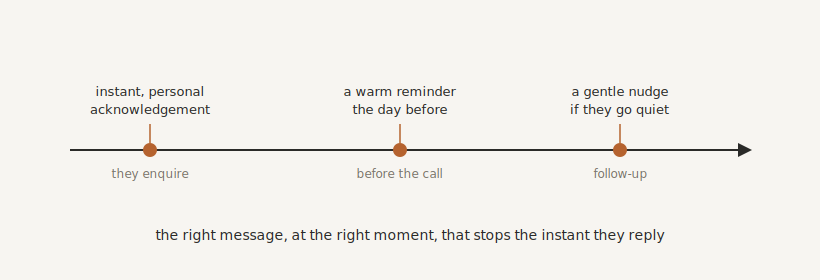

# Communications That Build Trust

By the end of this chapter you will know how to make your client communication always prompt, always consistent, and genuinely personal, without you typing each message, and without any of it feeling like it came from a robot.

## Where Trust Is Won or Lost

To your client, your communication very nearly is your business. They do not see your clever automations or your tidy Keystone. They see whether you replied quickly, whether you remembered what they asked, whether the reminder arrived, whether anything got dropped. The whole impression of whether you are reliable, professional and worth their money is formed, message by message, in their inbox and on their phone.

And the great enemy of that impression is silence. The enquiry that vanishes into a black hole for three days. The lead who quietly drifts away, not because they were not interested, but because nobody followed up while they still cared. The client left wondering whether you forgot them. Most lost business does not leave in a dramatic exit. It leaks out through the gaps in your communication.

The good news is that you do not need to be awake at all hours to close those gaps. You need always-on communication without being always online. And that is exactly what automation is for.

## Automated, Without Being Robotic

Here is the fear, and it is a fair one. The moment you automate your messages, they start to feel cold. The generic "Dear Customer." The message that lands at the wrong moment. The "Hi [First Name]" that did not fill in. Done badly, automation makes you look less human, not more.

So the goal is automated and warm, and four things keep it that way.

It has to be personal. Use their actual name, and refer to the actual thing they asked about, not a generic acknowledgement. "Thanks for your enquiry about the garden redesign, Sarah" lands completely differently from "Thanks for contacting us." You are not writing it by hand, but it should read as though you might have.

It has to be well-timed. The right message at the right moment. The acknowledgement the instant they enquire, so they know they have been heard. The reminder the day before the appointment, not a week early. The follow-up tomorrow morning, not four seconds after they hit submit. Timing is most of what makes a message feel attentive rather than automated.

It has to be useful. Every message should earn its place by helping: an answer, a next step, a piece of reassurance. A message that exists only to "check in" is noise. A message that tells them what happens next is a kindness.

And it has to be easy to reply to. Let people respond directly to the text or the email. The moment you make someone dig out a phone number or log into a portal just to answer you, you have added friction, and friction quietly kills trust.

{#fig-comms-timing width=90%}

## Reducing the Uncertainty

Two of the most expensive things in a service business, no-shows and ghosting, are mostly communication problems, and mostly preventable. Not with more chasing, but with calm, pre-emptive messages that reduce uncertainty for busy, distracted people.

When someone enquires, acknowledge it immediately, so they are not left wondering whether it even arrived. Before an appointment, send a friendly reminder, and better still, a quick confirmation they can reply to. One contractor I know set up nothing more than a reminder the day before and a "we are on our way" the hour before, and his no-show rate fell to almost nothing. When a lead goes quiet, a gentle, spaced nudge or two brings a surprising number back to life, and a light-touch check-in weeks later revives some of the rest.

None of that is nagging. It is the behaviour of a thoughtful assistant who keeps things on track without being pushy. You are simply removing the doubt that makes busy people drift away.

## The Golden Rule: Know When to Stop

There is one thing that destroys trust faster than silence, and it is the wrong automated message. The "just checking you got our proposal" that arrives the day after they signed it. The reminder for an appointment they already rescheduled. Nothing makes a business look more like an unthinking machine.

So the single most important rule of automated communication is this: it must stop, or change, the moment the situation changes. If they reply, pause the sequence. If they book, cancel the chasers. If they pay, stop the reminders. For that to work, your automations need to know the full story, which is precisely why all of this sits on top of the single source of truth we have been building. Because the communication runs through your client operating system and draws on your Keystone, it behaves with context, not blindly. It knows this person already booked, and holds its tongue.

## Let It Sound Like You

You may be wondering how to make messages personal and warm at scale without either writing each one by hand or settling for stiff templates. This is where two things you have already built come together.

Your brilliant new hire, the AI, can draft these messages for you, and because it draws on your Keystone, it writes them in your tone, with your knowledge, fitted to the actual situation. Not a rigid template with a name slotted in, but a genuinely appropriate message that sounds like you on a good day. You set the intent and the guardrails; it handles the wording. The result is communication that is automated, instant and consistent, and yet still feels like it came from a person who knows the client. That combination, which used to be impossible, is now simply how a well-run business communicates.

## Where We Go Next

Communication is one job you have now handed to your systems, and it is a big one. But it points at something larger. If a system can hold a warm, well-timed conversation with your clients, what else could you hand over, not just the messages, but the work behind them? That is the next chapter: putting AI and bots to work as genuine digital teammates.

> **Try this.** Take the single most important message in your business, almost certainly your first reply to a new enquiry. Write the version you would send if you had all the time in the world: warm, personal, genuinely helpful, with one clear next step. That is now your brief. From here on, that message can go out in thirty seconds instead of three hours, to every enquiry, without you ever writing it again.
