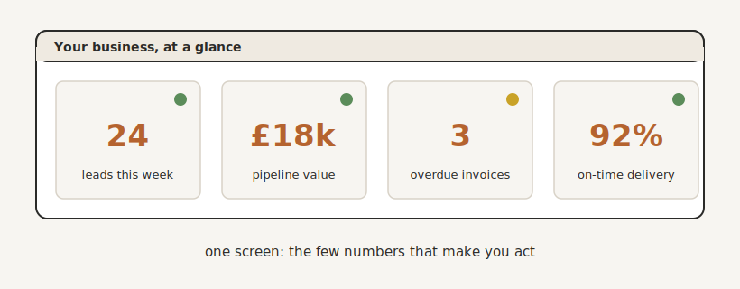

# What Gets Measured Gets Managed

By the end of this chapter you will know how to see your whole business at a glance, on a single screen, so that you can lead it with facts instead of gut feel, and step away from it without the whole thing wobbling.

## The Oldest Rule in Management

Peter Drucker is usually credited with the line that titles this chapter: what gets measured gets managed. It has lasted because it is true. You cannot improve what you cannot see. You cannot trust what you cannot see. And you certainly cannot step back from what you cannot see, because the moment you look away, you have no idea what is happening.  (Drucker stated that the converse is equally true - Shine a light on a number, and that number will generally improve.)

Right now, like most owners, you probably run your business on a patchwork of spreadsheets, sticky notes, and a great deal held in your head, plus maybe the odd report from your finance system. And it works, in the way that juggling works, right up until you add one more ball. The fifth hire. The thirtieth client. The second location. Suddenly you cannot hold it all in your head any more, and the cracks start to show. That is not a failure. It is the moment your business outgrows being run from memory and starts needing to be run from a screen.

That screen is a dashboard. Not a report you generate once a month, but a living control panel, a cockpit, that shows you the health of your business in real time. One pane of glass that tells you, at a glance, whether things are on track or heading for a wall. This is the visibility you have quietly lacked since the very first chapter, the cure for never quite knowing what is going on. And, not incidentally, it is the architect's view from the pit wall: you, watching the telemetry, instead of you, under the bonnet.

## From Checking Up to Checking In

Remember the position you reached at the end of the last chapter. You now have a team of people and digital teammates running your business, and you cannot possibly stand over every one of them. So how do you know it is all working?

A dashboard is the answer, and it changes the very nature of how you oversee things. Instead of checking up, interrupting people to ask "where are we with this?", you check in, by glancing at a screen. The information comes to you, without you having to extract it from anyone. This is how you manage without micromanaging, how you keep your finger on the pulse without your hand on everyone's shoulder. And it is, more than anything else, what finally lets you take a fortnight off. Not because nothing could go wrong, but because if it did, you would see it, from a beach, on your phone, in ten seconds.

{#fig-dashboard width=90%}

## Measure the Few Things That Matter

The temptation, the moment you can measure anything, is to measure everything. Resist it. A dashboard that shows everything ends up showing nothing, and tracking the wrong things is worse than tracking none, because it gives you false confidence.

The test of a number worth watching is brutally simple. Does it make you act? If that number dropped tomorrow, would you do something about it? Then it belongs on your dashboard. If it could halve and you would only shrug, it is not a measure, it is trivia, however nice it looks. The followers, the page views, the vanity numbers that feel good and change nothing, leave them off.

Work backwards from the decisions you actually make. To grow, you need to see your pipeline: leads in, conversion, where deals stall. To stay solvent, you need to see cash: what is owed, what is overdue. To keep clients, you need to see delivery: what is on time, who is overloaded, what is slipping. A handful of numbers, three to seven, not forty, that together tell you whether the business is healthy today. Clarity, not complexity.

## Don't Rely on System Dashboards

[Need something in here about how it's easy to skim over this chapter because your major systems (your finance system, your CRM, your delivery systems) all come with reporting and dashboards.  However these never show you the key numbers, as they are usually designed by the wrong people (Accountants for the finance dashboards, Marketers for CRM dashboards), and can't show you the complete picture (because they don't have all the data).  An example, Xero should have all the data to show you numbers like Lifetime Value, Churn, yet it doesn't have these business reports.  Instead of relying on these, roll your own.  It's never been easier to stand up a dashboard, and yours will be unique to your business. ]

## Turn the Numbers Into Decisions

A dashboard you glance at but never act on is just expensive wallpaper. The value is not in the looking. It is in the deciding.

So build a small ritual around it. A five-minute look each morning. A slightly longer review on a Friday, where you pick the one thing the numbers are telling you and do something about it. Keep the signals simple: green, amber and red beats a twenty-page report every time, because your eye knows what matters before your brain has finished reading. When your average onboarding time quietly jumps from three days to seven, you see it that morning and ask "what changed?", rather than discovering it at the month-end review, three weeks too late. Your business becomes a feedback loop: something slips, you see it, you fix it fast. That speed, the seeing and the fixing, is most of what separates a calm business from a chaotic one.

You can go a step further.  Imag

## It Has to Build Itself

Here is the trap that kills most dashboards, and you have met it twice already in this book. If a human has to update it, it dies. A dashboard someone keys in every Friday is not real-time. It is a delay wrapped in a data-entry liability, and it will rot exactly the way your old CRM and your old process documents rotted, for exactly the same reason.

So the only dashboard worth building is one that updates itself. And by now you have everything it needs. It draws its numbers straight from your single source of truth, your client operating system and your Keystone, kept current by the connectors and the digital teammates you have already built. A booking, a payment, a completed task, each one updates the dashboard the instant it happens, with nobody touching a spreadsheet. The dashboard is not another thing to maintain. It is simply a window onto the machine you have spent this whole part building.

## Clarity, and the Freedom to Step Away

There is a quieter benefit to all this that is worth naming. When you make decisions from real numbers rather than from a churning gut, you stop second-guessing yourself, and that calm is contagious. Your team feels it. Your clients feel it. You lead differently when you actually know.

And you get the thing you have wanted since page one. You no longer have to be everywhere at once, because you can see everywhere at once. The business runs on systems and shows you the truth on a screen, which means you can finally lift your head, and step away, without it falling over.

## The Build Is Complete

Stop for a moment and look at what you have. A Keystone, the living memory that holds how your business runs. The machinery on top of it: connectors moving work between your tools, a client operating system at the hub, guardrails catching the errors, communications that build trust, and a team of digital teammates doing the tireless work. And now, the visibility to run all of it at a glance.

That is an automatic business. The building is done.

What remains is the reward. In Part Four we turn this machine to the purpose you started for in the first place: scaling it without the chaos, winning back your time, and building something that runs, and could one day sell, without you. That begins now.

> **Try this.** If you could see only three numbers about your business, just three, which three would tell you whether it is healthy today? Write them down. That is the beginning of your dashboard, and the beginning of running your business on facts instead of feel.
