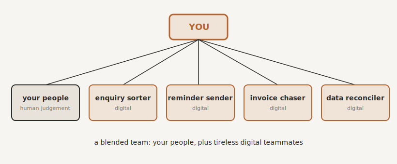

# Digital Teammates: Delegating to Bots and AI

> *"You'll be paid in the future based on how well you work with robots."*
>
> Kevin Kelly

By the end of this chapter you will stop thinking of your automations and your AI as software, and start thinking of them as what they really are: a team you employ, deploy, and manage.

## You Have Been Hiring Without Realising It

Everything you have built across Part Three, the connectors, the client operating system, the guardrails, the communications, has a quiet implication you may not have noticed. You have been hiring.

Each of those automations is, in effect, a new member of staff. A tireless one. It turns up every day, never sleeps, never forgets, never gets bored of doing the same thing for the thousandth time, and never asks for a raise. Add your AI to the mix and you have something more capable still. Together, they make up a digital workforce that is already doing real jobs in your business.

This is the mindset shift that makes the rest of it click. Stop thinking "tools" and start thinking "team." You are no longer the technician operating the machinery. You are the architect we met in Part One, except now you are managing a workforce that happens to be made of software as well as people. There is an old line about how, if you want to go far, you go together. The quiet upgrade of this decade is that "together" now includes a team of digital teammates who never clock off.

## From Dumb Bots to Capable Teammates

It is worth being clear about what has changed, because it is the reason this chapter exists now and could not have been written a few years ago.

For a long time, a "bot" could only follow rigid rules. It was the deterministic automation from the triage: brilliant at the perfectly predictable, useless at anything that wandered off the script. Genuinely useful, but limited. You could hand it the rote work and nothing else.

Now your digital teammates come in two kinds, and they work together. There is the rule-follower, the automation, doing the deterministic steps exactly as before. And there is the AI, your brilliant new hire, handling the judgement-lite work that no rule could capture: reading the messy email, sorting the enquiries, drafting the reply, deciding, within the bounds you set, what to do next. A modern digital teammate is often the two of them in partnership, the automation handling the mechanical, the AI handling the fuzzy, both drawing on your Keystone so they act with the context of your business. The range of work you can now hand over has expanded enormously. That is the news.

## Start by Handing Over the Mental Load

When people think about delegating to a digital team, they think about tasks. Sending the invoice, updating the record, booking the call. And yes, hand all of that over: the recurring billing, the data entry, the reconciliation, the scheduling, the chasing. It is boring for a human and perfect for a machine.

But there is something more valuable to hand over than the tasks, and almost nobody talks about it. It is the mental load.

Think about the weight you carry that is not the work itself, but the remembering to do the work. The seventeen small things nagging at the back of your mind today, none of them hard, all of them yours to remember. The invoice you must send. The renewal coming up. The client who has not paid. The follow-up you promised. Even when other people do these tasks, you are still the one who has to remember to make sure they happen. You are the bottleneck even for the things you delegate.

A digital teammate takes that weight away, because it does not just do the task, it remembers the task so you do not have to. It turns "I must not forget to chase that" into "that is already handled." And when you stop spending your brainpower holding a hundred small obligations in your head, something changes. You get your headspace back. You start seeing the bigger picture again, spotting opportunities, thinking like the owner rather than the office junior. Freeing the hours matters. Freeing the head matters more.

## Manage Them Like a Team

Here is the part most people get wrong. They set up a few automations, lean back, and assume the job is done. It is not. A digital team is still a team, and a team without management drifts. The difference between a business that runs on automation and one that is quietly broken by it is whether anyone is managing the digital staff.

So manage them as you would manage people, with three light habits.

Give each one a clear job description. A name that says what it does, "new enquiry: log, confirm, alert," not "Automation 47," and a one-line note of its job, what sets it off, and what it touches. Six months from now, when you are wondering why something is misfiring, you will be very glad you did.

Review their performance. On a regular rhythm, quarterly is plenty, take a short look at your digital team. Are they still doing their jobs? Are any failing silently? This is where digital teammates differ from human ones in one important way: they never call in sick, but they also never tell you when they are broken. A short, regular review catches the silent failures before a client does.

And prune. Businesses change. The automation that was perfect at ten clients a month may be wrong at a hundred. So in that same review, retire the ones that no longer earn their place, rebuild the ones that could do more, and resist falling in love with a tool just because you built it. Treat your digital teammates exactly as you would your best employees: reviewed, rewarded, and, when their job no longer exists, let go.

## A Blended Team

Let me be clear about something, because it is the fear that sits under all of this. None of it is about replacing your people with a robot army.

It is about a blend. Your people and your digital teammates, each doing what they are best at, which is precisely the triage applied to your whole workforce. The humans do the human work, the relationships, the judgement, the care. The digital teammates do the tireless, repetitive, rule-bound and judgement-lite work that was burning your people out. You end up needing fewer people doing soul-destroying admin, and the people you keep are happier, because they are finally doing the work they were actually hired for, not babysitting a spreadsheet.

If the fear still lingers, the evidence now points the other way. In 2026, economists at Ramp and Revelio Labs linked the actual AI spending of more than twenty-one thousand American firms to their workforce records, to see what really happens to jobs when a business adopts AI. The firms that invested most heavily grew their headcount by roughly ten per cent over the two years that followed, and their entry-level hiring grew faster still, by twelve per cent. The firms that merely dabbled saw no measurable change at all.[^ramp] The robot army is not replacing the team. In the businesses doing this properly, it is paying for a bigger one.

And your own job settles into its proper shape. You stop doing, and you start directing: managing a blended team of people and machines, doing what only you can do, and letting everyone and everything else do the rest.

{#fig-digital-team width=90%}

## Where We Go Next

You now have a business run by a team of people and digital teammates. Which raises the obvious question for any manager: how do you know it is all working? You cannot stand over every automation and every person. You need to see, at a glance, what is humming and what is stuck. A manager who cannot see their team is flying blind. So the last piece of the build is visibility, and the principle is as old as management itself: what gets measured gets managed. That is the final chapter of this part.

> **Try this.** Write down the three things you carry in your head that nag at you most, the recurring "I must remember to" worries. For each one, ask a single question: could a digital teammate hold this instead of me? You are not making a to-do list. You are writing your first three job descriptions for staff who never sleep.

[^ramp]: Kharazian, A., Simon, L., & Stevens, R. (2026). *A New Look at AI's Impact on Jobs: Firm-Level AI Spending and Workforce Adjustment*. Ramp Economics Lab. https://ramp.com/data/ai-jobs-impact. High-intensity adopters grew headcount 10.2 per cent in the two years following adoption, with entry-level headcount up 12 per cent; low-intensity adopters showed no statistically significant change. The sample skews towards tech-forward firms.
