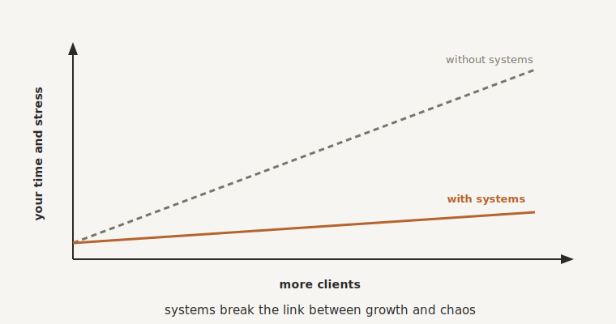

# Systemising Delivery

By the end of this chapter you will know how to make the way you deliver your service repeatable and reliable, so that taking on more clients makes you more money without making you more stressed, and without needing an army of new hires to cope.

## The Cruel Maths of Growth

Most owners are quietly trapped in a piece of arithmetic that makes growth feel like a punishment. More clients means more work. More work means more people to hire and manage. More people means thinner margins and more questions flowing back to your desk. So the business gets bigger and somehow harder, and you end up running faster on a treadmill that goes nowhere. Growth, instead of being the reward, becomes the thing that breaks you.

That maths only holds for one reason: your delivery is still bespoke. Every client is handled a little differently, held together by your memory and your people's goodwill, so every new client adds a fresh dose of chaos. Break that, systemise how you deliver, and the maths inverts. Each new client starts to add revenue without adding proportional chaos. That is what this chapter is for, and it is where the whole machine you built in Part Three finally pays off.

## Deliver Like a Lego Kit

The shift is to stop building every delivery from scratch and start assembling it from standard parts. A Lego kit, not a bespoke commission. The same reliable blocks, snapped together the same way, every time.

This worries people, because it sounds as though it would make the service cold and identical. It does the opposite. There is an old line worth keeping: systemise the predictable, so that you can humanise the exceptional. When the routine ninety percent runs on rails, flawlessly and without your attention, you and your team are freed to pour real human care into the ten percent that actually needs it, the judgement call, the personal touch, the moment that matters. The client does not experience a rigid process. They experience a business that never drops the ball and still feels personal exactly where it counts.

## Systemise the Journey: Onboarding and Fulfilment

Two parts of delivery give you the most leverage, so start there.

The first is onboarding, how a new client begins with you. It matters more than it looks, because it is the first real impression your systems make. A clumsy, delayed, something-always-missing start tells a client, on day one, that they may have chosen wrong. A smooth one tells them they are in safe hands. So decide what must happen every single time a client signs on, not what usually happens, or what happens when you remember, but what must. The welcome, the information you need, the kick-off, the first piece of value. Then let the machine run it: the steps live in your Keystone, the automation handles the rote parts, the guardrails catch anything missed. You are not inventing anything new here. You are pointing the tools you already built at the moment that sets the tone for the whole relationship.

The second is fulfilment, the actual doing of the work. This is where bespoke delivery quietly bleeds time and drops balls. The fix is the same: a repeatable framework for each service you offer, so that when a project starts, the whole shape of it appears at once, the steps, the owners, the deadlines, drawn from the Keystone and tracked automatically. Not a hundred-step manual nobody reads, but a clear, standard path that gives your team autonomy without guesswork. They stop asking "what now?", because the system has already answered.

## Support That Doesn't Depend on You

As you grow, so does the stream of client questions, and support is the silent killer of a scaling service business. When every query lands in your inbox, you are the bottleneck again, and the bottleneck is the ceiling.

You do not solve that by caring less. You solve it by designing support so it does not route through you. Funnel every channel into one place, so nothing is lost. And lean on something you have already built: your Keystone is, in effect, your business's brain written down, and most support requests are variations of the same dozen questions. So the answers already live there, and your AI can handle the first line of support by drawing on them, telling a client the status of their project or how to update their billing, instantly, in your tone, at any hour. Your people step in only for the genuinely tricky cases. You can even give your best clients a faster lane, white-glove treatment routed to them automatically, without you personally hand-holding every one. The client feels well looked after. You do not feel besieged.

## Scale Capacity Through Systems, Not Bodies

Here is the payoff that breaks the cruel maths we started with.

When delivery runs on systems, each new client costs you far less time and attention than the last. The tenth is easier than the fifth; the fiftieth barely touches you at all, because the system absorbs the work. That means you can grow without hiring in lockstep, and the margin that used to shrink with every hire starts to widen instead. And when you genuinely do need more people, the systems change what hiring even means. A new starter does not have to become the keeper of secret knowledge, because the knowledge lives in the Keystone and the process runs itself. They learn to operate the system, which takes days, rather than to be the system, which takes months. You have met this idea before: every part of your delivery should be operable by a capable, non-technical person following the system, not improvising from memory.

{#fig-scaling width=85%}

## Growth That No Longer Depends on You

Step back and see what has changed. You used to be the ceiling on your own business. Every new client needed more of you, so there was a hard limit, set by your hours and your energy, on how big the thing could ever get. Systemised delivery lifts that ceiling off. The business can take the next client, and the one after, without you being personally present in each. You have turned "more clients means more me" into "more clients means more system."

That is the precise difference between a job that happens to be growing and a business that genuinely scales. One grows until it crushes its owner. The other grows while setting its owner free.

## Where We Go Next

You can now deliver to far more clients than before, smoothly, consistently, without chaos and without yourself in the middle of every one. Which leaves you with a rather happy problem: you are going to need more clients to deliver to. So next we point the very same systems-thinking at the other side of the business, the demand side. Marketing and growth that runs without you, filling the machine you have just learned to scale.

> **Try this.** Take your single most repeated delivery process, almost certainly your onboarding or your core service flow. Write down only what must happen every time, for every client, with no exceptions. That short list is the blueprint for your first delivery system, and it is the thing that lets you say yes to the next ten clients without a flicker of dread.
