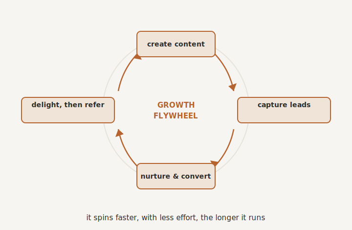

# Automating Marketing and Growth

By the end of this chapter you will know how to build a marketing engine that brings in a steady stream of clients quietly in the background, so that finding new business stops being another exhausting job you never have time for.

## From Hamster Wheel to Flywheel

Most owners do marketing in a panic. When work is slow, you scramble: post a few things, send some emails, chase some leads. Then a wave of clients arrives, you get busy delivering, and the marketing stops dead. A few months later the pipeline runs dry, and you scramble again. Feast, then famine, then feast. It is exhausting, it is lumpy, and it keeps you permanently anxious about where the next client is coming from.

There is a better shape, and it is the difference between a hamster wheel and a flywheel. A hamster wheel only moves while you are running in it; stop, and it stops. A flywheel is heavy to get going, but once it is spinning it keeps spinning, and it actually gets easier the longer it runs. A systemised marketing engine is a flywheel. It keeps bringing in leads whether or not you "did marketing" this week, because it does not depend on you remembering to.

This matters more than it first appears, because of a simple truth about your buyers. Most of the people who will eventually hire you are not ready today. They might be ready in six months, or in two years, when something in their world finally tips them into action. Bursty marketing only reaches the tiny few who happen to be ready in the week you bothered. An always-on engine keeps you quietly present for all the rest, so that when their moment comes, you are the one they think of.

## Capture the Attention You Already Earn

Before any of that, a leak to plug. Most businesses earn attention and then let it drain away. Someone finds you, has a flicker of interest, and leaves, gone for good, because there was nothing to catch them. A website that just says "contact us" is a shop with no front door.

So you give people a reason to put their hand up, and a way to do it. Something genuinely useful enough that a stranger will trade their email address for it: a short guide, a checklist, a quick assessment that answers a real question they have. They get something of value, and you gain permission to keep talking to them. That is the front door. Attention becomes a lead, instead of a visitor you never hear from again.

## Then Nurture, Patiently

Now you have a lead who is interested but probably not ready. The mistake is to either pounce on them like a startled salesman or, far more commonly, forget about them entirely. Both lose the sale.

The answer is to nurture: a gentle, automatic sequence of genuinely helpful messages, spaced out over time, that keeps you present and useful while they are not yet ready. Not nagging, and not the same chasers we warned against, but a steady drip of value that quietly builds trust and keeps you top of mind. The same rules from your client communications apply: helpful, well-timed, and it pauses the moment they engage. This is the engine doing the patient work that no busy owner ever manages by hand, staying in the room for the months or years it takes, so that you are there at the exact moment the lead becomes a buyer.

## Content Is the Fuel, and AI Multiplies It

A flywheel needs fuel, and the fuel is visibility: content that draws attention and feeds the front door. For most owners this is exactly where it falls apart, because creating content is slow, and even when you manage it, the piece gets used once and then dies.

This is where AI changes the game more than anywhere else in your marketing. You create the thinking once, and your brilliant new hire turns it into many things. One short video becomes a written article, a handful of social posts, a few quotable lines, and an email for your nurture sequence. You are not making more; you are squeezing far more juice from the same orange. The bottleneck on small-business marketing has always been the owner's time. AI relieves it.

And because the AI draws on your Keystone, what it produces sounds like you, with your knowledge and your point of view, not like generic content churned out by a machine. That is the crucial difference. Automated marketing used to mean bland and forgettable. Now it can mean you, amplified across every channel, without you sitting at a keyboard for hours. One good idea, captured once, can quietly feed your flywheel for months.

{#fig-flywheel width=80%}

## Make the Engine Run Itself

Stitch these pieces together and you have a machine. Content publishes on a schedule and draws attention. The front door captures the interested. The nurture sequence warms them over time. The booking and the handover flow into the client operating system you built in Part Three. And the whole thing reports to your dashboard, so you can see which front door works, which messages land, and what it costs to win a client, then quietly improve it.

Once built, this does not need babysitting. It needs traffic. A single useful guide can collect leads for years. A single well-made funnel can fill a calendar. You feed it, and it keeps giving back.

## The Warmest Engine of All

One last channel, and it is the strongest you have. In your world, the most powerful marketing is not an advert. It is a trusted recommendation. The vast majority of good business begins with someone being referred by a person they already trust.

You cannot automate the trust, nor would you want to. But you can systemise the unglamorous parts that owners almost always forget. Asking a delighted client for a review at the precise moment they are happiest. Making it effortless for them to refer a friend. Banking every kind word as proof you can show the next prospect. Done with a light, genuine touch, this turns your good work into a quiet, compounding engine of reputation, without you ever having to awkwardly ask, "so, do you know anyone who needs me?"

## Words are Cheap

## Where We Go Next

Look at what you have now. A business that finds its own clients, delivers to them smoothly, and runs the whole way through without you standing in the middle of it. Which brings us back, at last, to the only question that ever really mattered, the one you asked on the very first page. What was all of this for? Your time. The next chapter is about measuring exactly how much of it you have won back, and making sure you actually spend it on the things that made you start a business in the first place.

> **Try this.** Think of the single question every good prospect asks you before they buy, the one you answer over and over. Answer it once, properly, as a short piece of content: a page, a video, a simple checklist. Set it up to capture the people it attracts and nurture them gently afterwards. That one asset, working quietly in the background, can bring you clients for years. That is your first flywheel, and it starts turning the moment you build it.
