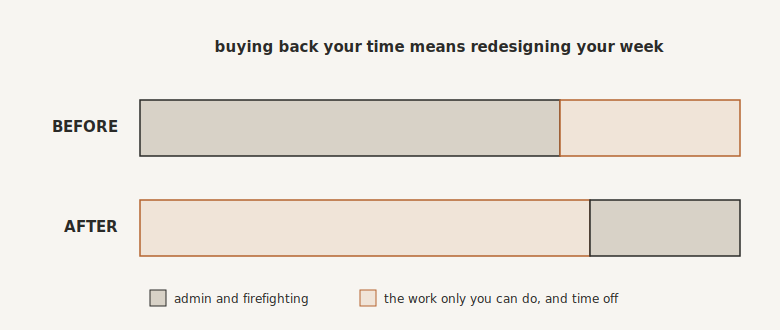

# Buying Back Your Time

By the end of this chapter you will know how to measure what all of this has actually given you back, in hours and in pounds, and, far more importantly, how to make sure you spend it on the right things.

## It Was Never About the Tech

Let me say the obvious thing out loud, because it is easy to lose in all the talk of triages and Keystones and flywheels. You did not do any of this to own a collection of clever automations. You did it to buy back the one thing you can never make more of: your time. The systems were always a means. Your time, and your life, were the end.

So it is worth measuring whether it worked. Not to admire the numbers, but because the thing you measure is the thing you take seriously. And the number you are about to put on your reclaimed time will, I suspect, surprise you.

## Count the Hours, and What They Are Worth

The method is simple. Take each thing you have handed to a system, and estimate honestly: how long did it used to take, and how often did it happen? A follow-up email that took ten minutes, thirty times a week, was five hours a week. Five hours a week is two hundred and sixty hours a year, from one small automation. Do that across everything you have systemised and the hours pile up fast.

Now put a price on an hour of your time, because until you do, you will keep treating it as free, which is precisely how you ended up doing admin at eleven at night. A rough internal hourly rate will do: your annual profit (plus any gross salary you pay yourself) divided by the hours you actually work. If you make two hundred thousand pounds and work a sixty-hour week, your time is worth around sixty-four pounds an hour. Multiply your reclaimed hours by that, and the value of even a handful of automations runs into tens of thousands of pounds a year.

Keep a simple tally as you go, three columns: the task, the hours it saves each week, and what those hours are worth. Be conservative with every figure. You do not need to inflate it. The honest number is startling enough, and watching it grow is oddly addictive, in the good way.

You might want to have a dashboard to track this. It's fun seeing the amounts go up. It will also correct the estimate you made of how often you do something - the automation will run a defined number of times.

## The Wins You Can't Put in a Spreadsheet

The hours and the pounds are the easy part to count. The bigger wins resist a spreadsheet.

There is the cost of the mistakes that simply stop happening, the lost clients and the refunds you will now never know you avoided, the re. There is the mental load lifted, the hundred small obligations no longer rattling around your head. There are the evenings that are actually evenings, and the holiday where the phone stays in the drawer. And there is the quiet compounding of it all: every hour you saved this week, you save again next week, and the week after, forever. These are the things you started a business for in the first place, and they had been slipping away from you. Now they are coming back.

## The Strange Feeling of Space

I want to be honest about something that catches a lot of owners off guard, because if no one warns you, you can mistake it for a problem.

When the chaos finally clears, the space it leaves can feel oddly uncomfortable. For years, being needed every minute was not just your job, it was part of who you were. Being indispensable felt like being important. So when the business carries on perfectly well without you in the middle of it, you can feel strangely vacant, even a little guilty, as though you ought to be doing something, anything, to justify yourself. It is the feeling of a parent on the first morning of school, standing in a suddenly quiet house.

This is normal, and it passes. Do not fill the silence straight back up with busywork just to feel useful again. Sit with it for a moment, because on the other side of that strange, empty feeling is the freedom you have been working towards, and the room to grow that you have not had in years.

## Spend It on What Only You Can Do

Which brings us to the most important decision in this whole book, and it is not a technical one. What will you do with the time?

There is a trap here, and it is a sneaky one. You free up ten hours, and without thinking you pour them straight back into more of the same low-value work, because that is the habit of a lifetime. Resist that with everything you have. The reclaimed time is not spare capacity for more admin. It is the whole point, and it is meant for the handful of things that genuinely need you and only you: the strategy, the key relationships, the creative leap, deciding where the business goes next. And, just as importantly, the things that are not about the business at all. The family. The rest. The life.

This is the title on the cover made real. Do what only you can do. Everything in this book has been in service of clearing your plate of everything else, so that the only things left on it are the things that are truly yours.

{#fig-your-week width=90%}

## The Two Freedoms

When you started reading, you wanted one of two things, and probably both. You wanted freedom: time, headspace, your life back, the ability to step away. And you wanted control: a business that is a real asset, steady, predictable, worth something, one you would be proud to show anyone, or even sell.

Here is the quiet truth at the heart of it. They are the same thing, seen from two sides. The systemised business that no longer depends on you is exactly the business that gives you your time back, and it is exactly the business that is finally worth selling. You do not have to choose between the freedom and the asset. Building one builds the other.

## Where We Go Next

There is a question hiding inside all of this, and almost nobody answers it well. Once the plate is finally clear and the hours are your own again, how do you decide, on any given morning, what actually deserves them? Reclaimed time slips away more easily than you would think, and the tools most of us reach for to manage it quietly make the problem worse. The next chapter is about how you decide what to do now, and how to stop drowning in a hundred things that all insist they come first. Then, right at the end, one last job remains: keeping the machine running without climbing back into it.

> **Try this.** List the five tasks you have most wanted off your plate. Beside each, write the hours it eats every week and what an hour of your time is worth, and add it up. That annual number is what you are buying back. Then write one more line: the single thing you will do with the first ten hours you reclaim. Make it something only you can do, or something that has nothing whatsoever to do with work.
