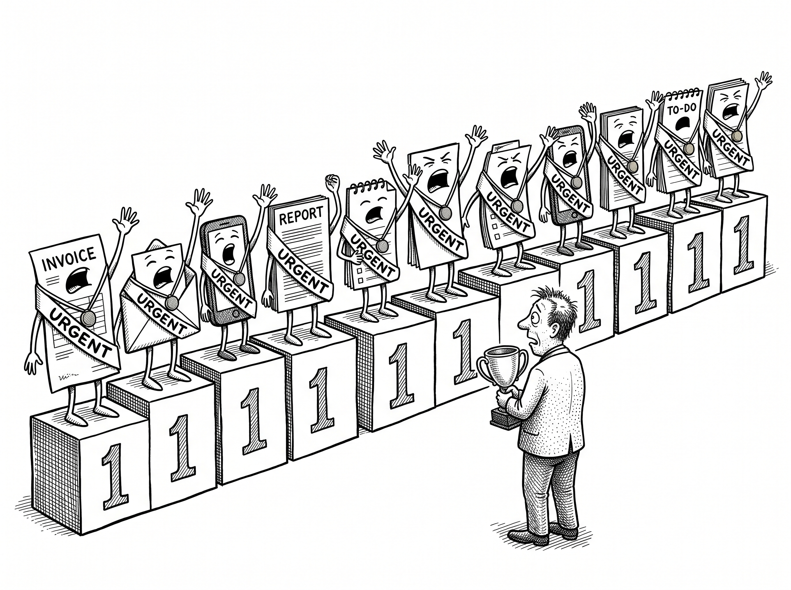
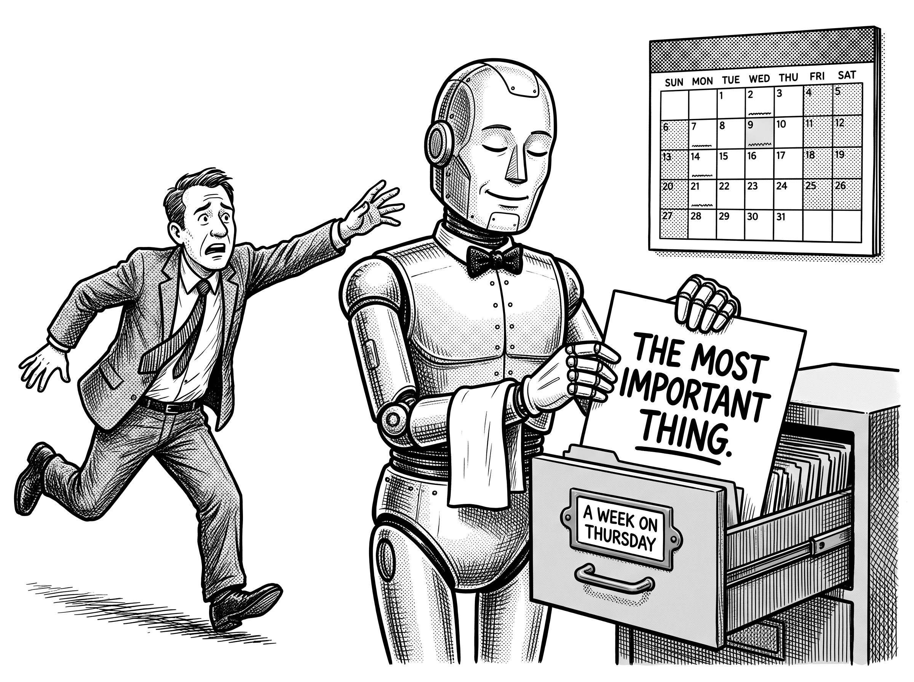
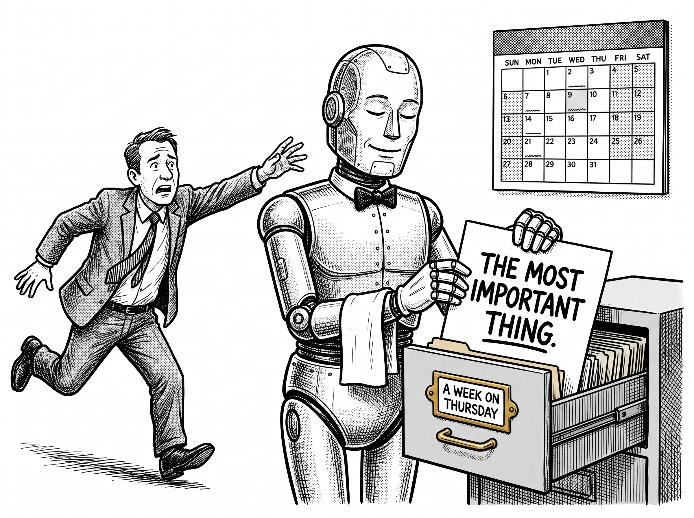
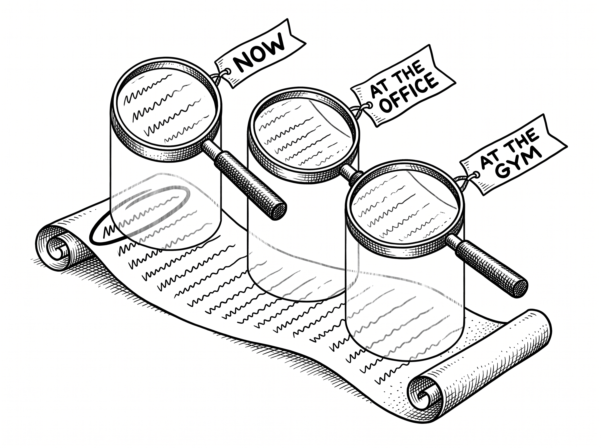

# Everything Is Not a Priority

> *"If you don't prioritize your life, someone else will."*
>
> Greg McKeown, Essentialism

By the end of this chapter you will know where all your work should actually live, why the cleverest scheduling tools on the market quietly make the overwhelm worse, and how to decide, on any given morning, what genuinely deserves you.

## "Priorities" Is a Word We Broke

Here is a small piece of history that turns out to matter. The word priority came into English in the fourteenth century, and for around five hundred years it had no plural. It could not have one. A priority was the first thing, the prior thing, the one that came before all the others. There was only ever one. It was not until the twentieth century, and the arrival of the modern office, that we started talking about priorities, plural, and began the quiet madness of believing we could have many first things at once.[^priority]

Read your own task list back with that in mind. Everything on it is flagged important. Everything is urgent. Everything is a priority. Which is exactly the same as saying nothing is, because if it is all first, then there is no first at all. You have not made a list of priorities. You have made a list of anxieties, and told yourself it was a plan.

::: {.content-visible when-format="typst"}
{fig-alt="An Olympic podium with fourteen first-place steps; every task wears a gold medal and an URGENT sash, while the judge holds a single trophy." width=92%}
:::
::: {.content-visible unless-format="typst"}
{fig-alt="An Olympic podium with fourteen first-place steps; every task wears a gold medal and an URGENT sash, while the judge holds a single trophy." width=92%}
:::

## The Overwhelm Is Not a Character Flaw

Before we fix the list, I want to say something plainly, because I suspect a lot of owners quietly believe the opposite. If you feel permanently behind, scattered, unable to hold a thought for long before the next ping drags it away, that is not a personal failing. It is the water we are all swimming in now.

The numbers are sobering. Around eighty per cent of small business owners say running their business has harmed their mental health, and roughly seven in ten owners and senior leaders report the symptoms of chronic burnout.[^burnout] And it is not only business owners. The researcher Gloria Mark has spent two decades measuring how long any of us can hold our attention on a single screen before it jumps, and the average has collapsed from about two and a half minutes in 2004 to roughly forty-seven seconds today.[^attention] Worse, every jump carries a cost that lingers. Sophie Leroy's work calls it attention residue: when you switch tasks, part of your mind stays snagged on the last one, so you are never quite fully present on the next.[^residue] You are not imagining the fog. Researchers have been measuring it for years.

There is a bigger conversation happening about this too. Diagnoses of adult ADHD have climbed sharply, with positive screenings rising from roughly one in ten adults a decade ago to something closer to one in seven now, and most experts believe it is still widely under-diagnosed.[^adhd] I am not here to diagnose anyone, and you do not need a clinical label for any of this to apply to you. It certainly applies to me.  The point is gentler and more universal than that: the modern working day is engineered to fracture your attention, and it is doing it to all of us, whatever our wiring. So let us stop treating overwhelm as a moral weakness to be willed away, or a medical condition to be lived with, and start treating it as what it actually is, a design problem with a design solution.

## The Cleverest Tool Makes It Worse

You would think the answer would come from software, and specifically from AI. It is exactly the sort of problem the technology ought to be brilliant at. And here is the surprising thing: some of the cleverest tools on the market are making it worse, for a reason that goes to the heart of everything in this book.

Take the current darling of the category, an AI scheduler that promises to plan your day for you. You feed it your tasks, each one tagged with a start date, a due date, whether the deadline is hard or soft, and a priority of urgent, high, medium or low. The AI then arranges the whole lot into your calendar around your fixed meetings. And, in fairness, the engine is genuinely impressive. A meeting appears out of nowhere and it reshuffles the day in an instant. You miss a task and it rolls it forward. It never drops anything.

So why does almost everyone who tries it end up quietly abandoning it? Two reasons, and they are the same reason in different clothes. First, it optimises against a mountain of little settings that no normal, busy human ever keeps accurate. You forget to mark the hard deadlines, you never touch the priority field, and so the machine is scheduling your life against information you never really gave it. Second, and this is the fatal one, it never once asks you to confirm the order, and it gives you no proper way to overrule it. So you open your beautifully scheduled day, look at the task sitting in your ten o'clock slot, and think, that is not the most important thing right now. And you do something else. Then you spot the thing that genuinely matters most, and the algorithm has filed it away in the middle of next week, behind a bunch of old tasks you already did, but forgot to update the system, because you weren't working from the system.

::: {.content-visible when-format="typst"}
{fig-alt="An immaculate butler robot files a document stamped THE MOST IMPORTANT THING into a drawer labelled A WEEK ON THURSDAY." width=85%}
:::
::: {.content-visible unless-format="typst"}
{fig-alt="An immaculate butler robot files a document stamped THE MOST IMPORTANT THING into a drawer labelled A WEEK ON THURSDAY." width=85%}
:::

This is the lesson of the triage, and of the whole book, arriving at the scale of a single day. The tool failed not because its AI was weak but because it let the AI do the deciding. It prioritised for you, silently, instead of helping you prioritise. Remember the rule from earlier in these pages: the machine proposes, the human disposes. A tool that quietly makes your most important decision for you, and then will not let you take it back, has not removed your overwhelm. It has automated it and amplified it.

## Boards and Projects Answer the Wrong Question

The older tools fail in a quieter way. Trello organises your work into boards. Teamwork, and most of its rivals, organise it into projects. Both are good at what they do, and both answer a question you were not really asking. They can tell you, in loving detail, everything that exists: every card, every project, every task sitting in every column. What not one of them does gracefully is answer the only question you actually have when you sit down in the morning, which is this. Out of everything, everywhere, across every client and project and corner of my life, what is the single most important thing for me to do right now?

You cannot answer that from a board, because a board shows you one project at a time. You cannot answer it from a project list, because your life is not lived one project at a time. The most important thing you could do this morning might be sitting in a project you were not even planning to open. These tools keep your work tidy in its boxes. They simply cannot lay the whole of it end to end and put it in order.

## Order Is the Decision

So here is the shift, and it is almost aggressively simple. You keep one list. Not one list per project, not one board per client. One list, for everything, and you put it in order, top to bottom, most important at the top.

That order is not a label on the task. It is the decision itself. This is why the fix is to throw the priority field away, not to fill it in more diligently. The moment you have a High, Medium and Low setting, everything becomes High, because in the heat of the moment everything feels high, and you have learned nothing. But a list can only have one top line. Position is honest in a way a label never is. Something is either more important than the thing below it or it is not, and you decide by dragging it up, or down.

If ranking a hundred things at once sounds impossible, that is because it is, and you should not try. Here is the quiet trick your brain is already good at. You are hopeless at ranking a hundred items in the abstract, but you are excellent at comparing two. Is this more important than that? You can answer that instantly, every single time. And a list you can always reorder is really just a long, easy chain of those tiny two-way choices. You never rank the hundred. You just keep making the one comparison that happens to be in front of you, and the order takes care of itself.

## The Default Diary

An ordered list tells you what to do next. It does not, on its own, tell you when. For that, you shape the week before it begins.

I think of it as a default diary, a concept introduced to me by my coach, Jeff Gosling. Rather than facing each day as a blank, infinite field into which any task might fall, you block the week out by the kind of work it holds: time for client meetings, time for the actual client work, a slot for admin, a slot for the internal jobs that keep the business itself moving, and, most precious of all, protected time for the deep, needle-moving thinking that only you can do. And then, because you are a human being and not a machine, you block the rest too: the exercise, the school run, the evening that is allowed to just be an evening. The list meets a shape, instead of spilling formlessly across every waking hour. When the deep-work block arrives, the list already knows to show you the deep work. This is how the promise of the last chapter, doing only what only you can do, stops being a nice sentiment and becomes a slot in your actual week that nothing else is permitted to steal.

## One List, Many Lenses

The obvious worry with putting everything on one list is that it becomes enormous and impossible to face. It would be, if you had to look at all of it at once. You never do. The list is one thing; what you see of it at any given moment is another thing entirely.

You look at the list through lenses. In a client-work block, you see only the client work. During admin time, only the admin. And the most natural lens of all is simply where you happen to be. Attach your work to places, and the list quietly adapts: the office tasks vanish the moment you leave the office, so they stop nagging you at the dinner table; your training plan surfaces when you walk into the gym; the shopping list appears when you are standing in the supermarket, and not one second before. None of these are separate lists to maintain and let fall out of sync. They are all the one list, filtered down to the only slice that matters where you are standing, right now.

::: {.content-visible when-format="typst"}
{#fig-one-list width=85%}
:::
::: {.content-visible unless-format="typst"}
{#fig-one-list-screen width=85%}
:::

## Where All the Work Finally Lands

Step back and look at what this list is really for, in the context of everything you have built. Your Keystone surfaces things that need doing. Your digital teammates hand work back to you. The triage sends you the handful of jobs that genuinely need a human, and that human is you. All of that signal, from all of those sources, has to land somewhere and be put in order by the one person allowed to decide. That somewhere is your one list. It is the place where the whole automatic business finally meets your own two hands, and you choose.

Your personal keystone can help you by reviewing your list and suggesting changes to the order as things change, but it's your list.  You call the shots.  You can accept the suggestions, or ignore them.

I believe in this so completely that I went and built it, because nothing on the market did it the way this chapter describes. It is called the One List, and it works exactly like this: one ranked list, the order in your hands and never the algorithm's, seen through whatever lens fits the moment, working for your work, your team's work, and work you share with clients.  It manifests the default diary, and more lenses than you'll ever need. It is private and invite-only, and I am not going to pretend otherwise or dress this up. But if reading this chapter has made your fingers itch to try it, readers of this book can skip the queue. Go to theautomaticbusiness.co.uk/onelist and ask for a way in. That is the only sales pitch you will get from me in this entire book, and I have now made it, so we can move on.

## Where We Go Next

You have built the machine, measured what it gave back, and learned how to point your reclaimed attention at the one thing that matters most at any moment. One job remains, and it is a discipline rather than a task: keeping all of this running well without quietly climbing back into the gears you fought so hard to escape. To maintain, without sliding into micromanaging. That is the final chapter, and it is about staying free.

> **Try this.** Put every task rattling around your head onto a single list: from every project, every client, every corner of your life, all in one column. Do not categorise it, do not tag it, just get it out of your head and into one place. Then go down it and, for each pair, ask only this: is this one more important than the one below it? Drag until the top three lines are genuinely the three things that matter most right now. Notice how much lighter the list feels the instant it has an honest order. Then go and do the top one.  It is, as they said until recently, your priority.

[^priority]: The etymology is drawn from Greg McKeown, *Essentialism: The Disciplined Pursuit of Less* (2014). "Priority" entered English in the 1400s as a singular noun and stayed singular for roughly five centuries; the plural "priorities" only came into common use in the twentieth century.
[^burnout]: FreeAgent, "Burnout Britain" (2023), reported that around seven in ten business owners and senior leaders showed symptoms of chronic burnout; Simply Business "Mind Your Business" research found that roughly eighty per cent of small business owners had experienced poor mental health, alongside markedly longer working weeks and far less annual leave than the employed average.
[^attention]: Gloria Mark, *Attention Span: A Groundbreaking Way to Restore Balance, Happiness and Productivity* (2023). Mark's measurements show average sustained attention on a single screen falling from about two and a half minutes in 2004 to roughly forty-seven seconds in recent years.
[^residue]: Sophie Leroy, "Why is it so hard to do my work? The challenge of attention residue when switching between work tasks", *Organizational Behavior and Human Decision Processes* 109 (2009), pages 168 to 181.
[^adhd]: Drawing on University College London and NHS England analyses of ADHD in England: positive adult ADHD screenings rose from roughly one in ten in 2014 to about one in seven by 2023 to 2024, while NICE estimates three to four per cent of adults have the condition, which remains widely under-diagnosed.
