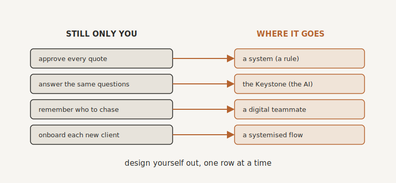

# Maintaining, Not Micromanaging

By the end of this chapter you will understand the final job you have, the one that keeps you free rather than dragging you back in, and you will see the whole of what you have built.

## The Danger at the Finish Line

You have built the machine. Leads arrive and look after themselves, the work gets delivered without you hovering, the messages send, the numbers show up on a screen, and your team is no longer chasing its tail. You might even feel a little redundant. That feeling, as we saw earlier, is the goal, not a problem.

But there is one last danger, and it is not that the systems will fail. It is that you will climb back in.

This is the trap that catches owners right at the finish line. After years of being the bottleneck, being needed is a hard habit to break. So you find yourself jumping on every tiny issue, tweaking automations that were working perfectly well, asking for updates the dashboard already gives you, inserting yourself into decisions that no longer need you, all out of an itch you cannot quite name. Bit by bit, you climb back into the gears you fought so hard to climb out of, and quietly make yourself the bottleneck all over again. The final discipline of this book is the hardest one, because it is a discipline of restraint. Maintain the machine. Do not micromanage it.

## The Difference Between Maintaining and Meddling

There are two ways to get this wrong, and they are opposites. The first is to walk away entirely and hope the system gods keep everything humming. The second is to go full micromanager, fussing over every notification as though it were a bonsai tree. Both end badly. What you want is the narrow path between them: tending your systems like an owner, not babysitting them like an over-caffeinated intern.

The line is simpler than it sounds. You watch from the pit wall, the architect's seat we have talked about since Part One, and you step in only when something genuinely needs you. When an issue surfaces, train yourself to ask one question before you touch anything: does this need me, or does it need the system improved, or someone else? Most of the time, the honest answer is not you. Resist the little hit of satisfaction that comes from diving in and fixing something yourself. That hit is exactly what will drag you back into the weeds. Being busy can feel like working. It usually is not.

## A Light Hand on the Tiller

Maintaining well takes far less time than you fear. It is a rhythm, not a job.

Once a quarter, block out half a day and treat it as what it is: strategy time, not admin. Phone off, no calls. Take your systems in for a service before they break down on the motorway. Look at what is saving the most time, what has quietly broken, what has drifted out of step with how the business now works, and what has simply become obsolete because your offer has moved on. Keep your Keystone honest in the same review, because it is the memory everything else draws on, and if it drifts, everything drifts with it. A small, regular tune-up like this prevents the slow creep of chaos far more cheaply than firefighting ever did.

And use a simple test for the things you notice in between. If it would take twenty minutes to fix and saves real time every week, fix it now. If it is bigger than that, write it down and bring it to the quarterly review rather than dropping everything today. Rebuild a system properly when the business has genuinely changed, not every time you have a passing idea. Restraint, again, is the whole game.

## Make the Whole Team the Mechanics

Here is the move that finally removes the last version of the bottleneck, the sneaky one. If you are the only person who can maintain and improve the systems, then you are still the constraint, just at a higher level. So do not be.

Train your people to operate the systems and to improve them. Teach the operator, not just the tool. Build a culture where anyone can say "this bit is clunky" and have it actually fixed, where improvements are logged so everyone can see how things are evolving, where the people closest to the work are trusted to make it better. When you do this, the machine improves without you being the one improving it. Even the upkeep of your automatic business stops depending on you. That is the last knot untied.

## A Business That Runs Without You

Step right back now and look at the whole thing.

The aim was never to remove yourself from your business entirely, off to a hammock, never to think about it again. The aim was to build a business that can run without needing you in the middle of it, so that your involvement becomes a choice rather than a life sentence. There is a simple exercise that makes this real. Draw up what I think of as your You Replacement Map: a list of everything that still, today, only happens because you are there to make it happen. Every decision only you make, every task only you do, every piece of knowledge only you hold. Then go down the list and, one at a time, design each one out, into a system, into a teammate, into the Keystone. You will never get the list to zero, and you should not want to. What is left at the end is only what you genuinely choose to keep, the work that is truly, only yours.

{#fig-replacement-map width=90%}

And here is the deepest reward of all, the one that ties the whole book together. A business that can run without you is the only kind that is truly an asset rather than a job. It survives your holiday, your illness, a month away. It can be handed to someone else. It can, when you choose, be sold, for what it is actually worth, because what a buyer is buying is a working machine and not a person who would quite like to leave. And the thing that makes all of this durable is the Keystone. Because your business's memory no longer lives only in your head, the business can genuinely outlast your daily involvement in it. You have done the rarest thing an owner can do. You have turned a job into an asset.

## The New Normal

Cast your mind back to where we began.

The morning that grabbed the wheel before you were even out of bed. The thought at two in the morning that, if you stepped away, the whole thing would fall over. The quiet sense of running a business that had somehow started running you. The cage.

Now look at the same business. It finds its own clients and delivers to them without you in every room. It remembers how it works, in a Keystone rather than in your head. It catches its own mistakes, communicates in your voice, measures itself, and improves with the help of a team you have set free to think. You started this book as the technician, the fixer, the bottleneck. You finish it as the architect of something that, at last, sets you free.

It turns out the answer was never to work harder, or to buy the cleverest new tool, or to live in fear of being left behind by AI. The answer was the oldest idea in business, made newly possible. Software has always been automation. You have simply, finally, pointed it at your own business, and decided, task by task, what belongs to a human, what to a machine, and what to AI.

The plate has been prised from your hands. What is left on it is only what was ever truly yours: the work that lights you up, the relationships that matter, the thinking, the leading, and the life you started all of this to have in the first place.

So go and do what only you can do. The business will be just fine without you in every gear. That, after all, was always the whole point.

> **Try this.** Draw your You Replacement Map. One column for everything that still runs only through you. Beside each, write where it should go instead: a system, a person, or the Keystone. You do not have to act on it all today. But the moment it is on paper, you can see the road from here, and you can see, perhaps for the first time, a business that no longer needs you in order to run, and an owner who is finally free to choose how he spends his days.
