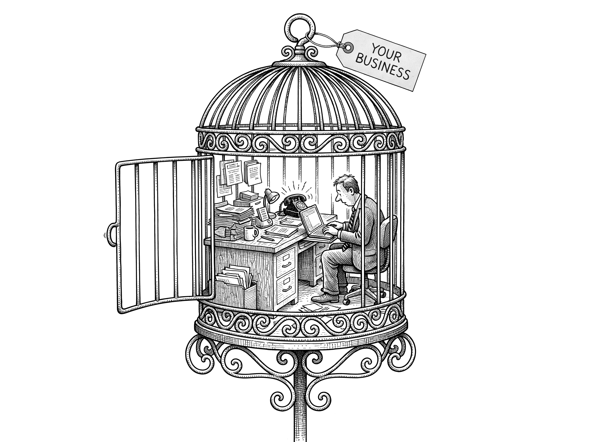
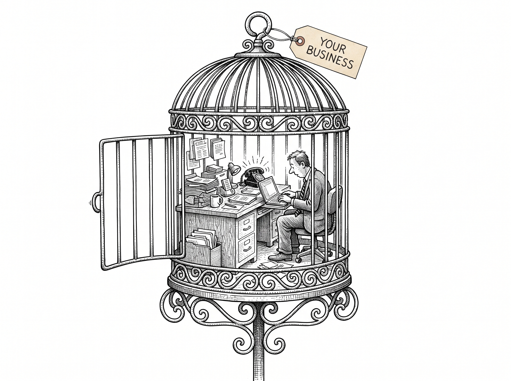

# Introduction {.unnumbered}

You didn't start your business to become a glorified task machine.

But if your days are spent buried in email, chasing leads, juggling calendars, fixing other people's mistakes and putting out fires, and your evenings are haunted by the to-do list you never finished, then somewhere along the way your business stopped being your route to freedom and started becoming your cage.

::: {.content-visible when-format="typst"}
{fig-alt="A birdcage holding a complete tiny office; the owner works on inside it, and the cage door stands wide open." width=80%}
:::
::: {.content-visible unless-format="typst"}
{fig-alt="A birdcage holding a complete tiny office; the owner works on inside it, and the cage door stands wide open." width=80%}
:::

I want to put something uncomfortable on the table before we go any further, because everything in this book depends on it.

Your problem is not that you do not have enough time.

I know it feels like a time problem. It is not. It is an architecture problem. Your business was built around you. Around your expertise, your judgement, your willingness to pick up whatever no one else could. It was never designed around systems. And that means you are not simply overworked. You are, in the most literal sense, structurally irreplaceable. Nothing has been built so that it could run without you, so nothing can. That is not a badge of honour. It is a design flaw. And like any design flaw, it can be fixed, but only once you stop trying to manage it and start trying to redesign it.

## The Hidden Cost of Control

There is a silent tax you pay every time you say, "it's just easier if I do it myself."

It costs you time. It drains your energy. It clutters your mind so you cannot think clearly about the things that would actually grow the business. Worse, it quietly makes you the single point of failure. Nothing moves without you. No decision, no follow-up, no delivery. The moment you step away, everything slows or stops.

You tell yourself you are being efficient, because you are busy. But busy and effective are not the same thing. Holding on to control is not saving you time. It is capping your growth and keeping you chained to your inbox, too tired at the end of the day to lift your head and look at the bigger picture.

## Freedom Is a System, Not a Fantasy

The answer is not to work harder. You have already proved you can do that, and it has brought you here. Growth does not come from doing more. It comes from leverage.

And in this era, leverage comes down to a single decision, made again and again across every task in your business: should this be done by a human, by automation, or by AI?

That one question is the spine of this whole book. Get the answer right, consistently, and the work stops flowing through you. The business starts to run on systems instead of on your presence. Get it wrong, or never ask it at all, and you stay exactly where you are. The bottleneck.

Ask most owners what they actually want, and once you strip it back, the answer is freedom. More time. More headspace. More money without more stress. But most have built a business that demands their constant presence, so freedom always stays one good hire or one quiet quarter away. Here is the truth: freedom is not a reward you earn after years of grinding. It is a result you engineer. Every task that completes itself, every handoff that happens without you, every client looked after while you sleep, is a brick in the foundation of it.

## Build Once, Benefit Forever

There is a moment every owner hits when they realise, "I cannot grow if I keep doing things this way." That moment is a fork in the road.

Down one path is more of the same. More hustle, more hours, more complexity with every client and every hire. Down the other is leverage, where you design a system once and it serves you for years. And systems compound. Every hour you save today, you save again tomorrow. Every mistake you design out, you never make again. Every process you hand to a machine scales with you, whether you have ten clients or ten thousand.

You do not need to be a technical genius to do this. You need the right way of thinking, the right decisions, and the willingness to stop doing everything yourself.

## The Road Ahead

Here is the journey we are going to take together.

**Part One is the diagnosis.** Why you became the bottleneck, and the shift you have to make from being the technician who does the work to being the architect who designs the system that does it.

**Part Two is the framework.** The decision at the heart of the book, human, AI, or automation. What AI actually is and, just as importantly, what it is not. And how to work out where to start.

**Part Three is the build.** How to put it all in place, beginning with the most valuable asset you do not yet have: a company second brain, a living record of how your business runs that no longer sits only inside your head.

**Part Four is the payoff.** A business that scales without chaos, hands you your time back, and could one day run, and even sell, without you in the room.

You have built habits around doing it all. The next level of your business will not come from doing more of that. It will come from doing less, better, with systems that never sleep.

You are not here to build a business that owns you. You are here to build one that frees you.

And that starts now.
